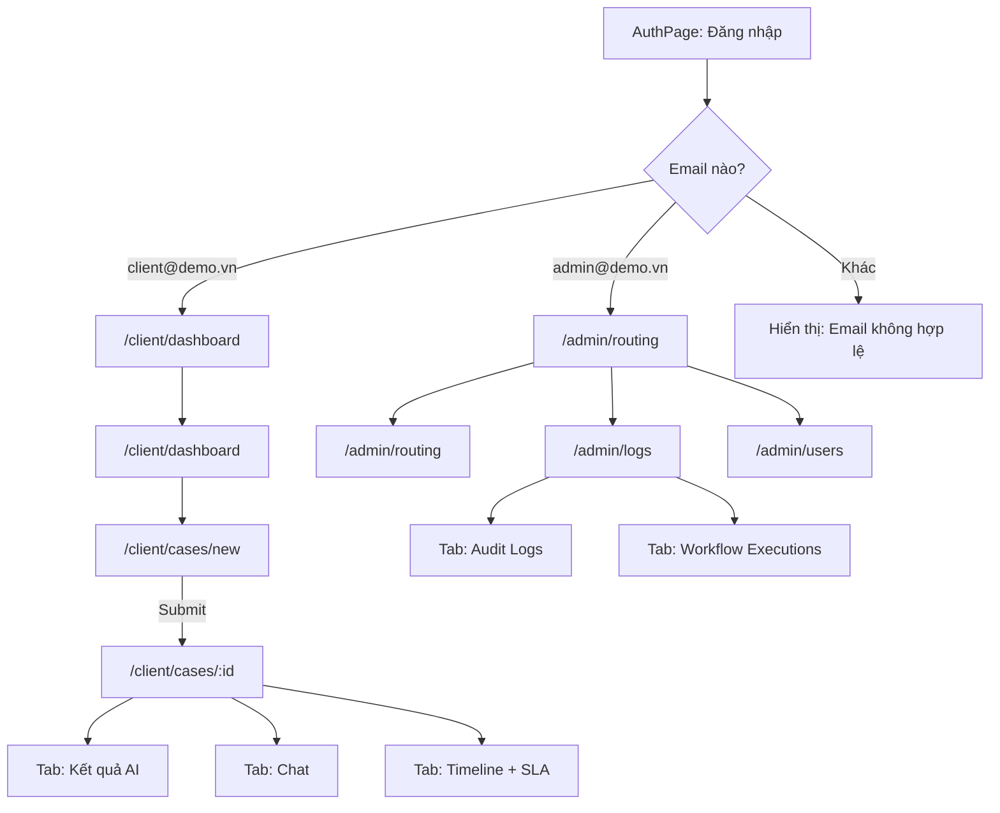

# LegalDesk AI -- Client Portal & Admin Console UI Plan (v4 -- Milestone 5 Focused)

## Ràng buộc từ Capstone Plan

- Chỉ 2 role: **Client** và **Admin**. Không có Lawyer trong v1.
- Mode: **full-auto** -- AI xử lý tự động, không có bước duyệt thủ công.
- Đây là **UI plan cho Milestone 5: Web Integration**, nên ưu tiên các màn core của Milestone 5 trước.
- Ưu tiên **thin vertical slice** cho phần UI: Client tạo hồ sơ -> xem kết quả AI -> chat theo case; Admin cấu hình routing -> xem users -> xem logs/audit trail.
- Chỉ các endpoint backend **đã có sẵn** mới được nối thật trong milestone này. Các surface chưa có API sẽ đi theo hướng **mock-first / hybrid**.
- Admin phải có surface cho audit logs và workflow executions trong M5 core; KPI guardrails thuộc nhóm stretch để phục vụ demo readiness/bảo vệ.

## Phạm vi của plan này

**M5 core bắt buộc**

- Client: `ClientDashboard`, `CreateCase`, `CaseDetail` (Overview + Chat + Timeline)
- Admin: `RoutingRules`, `UserManagement`, `OperationsLog` (Audit Logs là bắt buộc; Workflow Executions là mock-first enhanced surface)
- Tích hợp thật trong M5: `POST /v1/legal/review`, `POST /v1/legal/chat`

**Stretch / post-M5**

- `AdminDashboard` với KPI strip
- `SystemMonitor`
- KPI guardrails và health/readiness surfaces nâng cao
- Smoke test VPS và demo-pack polishing

**Định nghĩa "integration thật" trong plan này**

- "Real integration" ở đây có nghĩa là **UI gọi được các endpoint backend đã tồn tại** và render response thật.
- Không đồng nghĩa với toàn bộ luồng production upload -> OCR -> routing -> timeline đều đã có API web app hoàn chỉnh trong Milestone 5.

## Trạng thái hiện tại

- Frontend đang được tổ chức lại cho Milestone 5; plan này giả định sẽ tách lại thành cấu trúc module mới.
- Backend FastAPI đã hoạt động với các endpoint:
  - `GET /health` -- trả về `{ status, service, environment, timestamp, dependencies: { postgres: { status, detail }, redis: { status, detail } } }`
  - `POST /v1/legal/review` -- nhận `caseId`, `extractedText`, `metadata`, `language` -> trả `LegalReviewResponse`
  - `POST /v1/legal/chat` -- nhận `caseId`, `question`, `conversationContext`, `language` -> trả `LegalChatResponse`
- n8n orchestration đã có workflow intake, OCR, call AI, routing.
- Chưa có endpoint riêng cho: uptime, request count, response time metrics, n8n health, workflow execution logs.

## Kiến trúc thư mục

```text
frontend/
  index.html
  package.json
  vite.config.js
  tailwind.config.js
  postcss.config.js
  .gitignore

  src/
    App.jsx                    # Root routes
    main.jsx                   # Entry point
    index.css                  # Tailwind layers + custom styles

    layouts/
      AppShell.jsx             # Sidebar + topbar + content area (dùng chung Client/Admin)
      ClientLayout.jsx         # Wrapper cho Client routes, kiểm tra role
      AdminLayout.jsx          # Wrapper cho Admin routes, kiểm tra role

    components/
      ui/
        Button.jsx
        Badge.jsx
        Card.jsx
        Input.jsx
        Select.jsx
        Modal.jsx
        Tabs.jsx               # Tab switcher dùng trong CaseDetail và OperationsLog
        StatusBadge.jsx         # Render trạng thái pipeline (color-coded)
        RiskBadge.jsx           # Hiển thị riskLevel (low/medium/high)
        KpiCard.jsx             # Card hiển thị 1 KPI metric với label + value + trend
        Timeline.jsx            # Vertical timeline component
        FileUpload.jsx          # Drag-and-drop upload zone
        DataTable.jsx           # Table có sort/filter/pagination
        EmptyState.jsx          # Placeholder khi chưa có data
        Spinner.jsx             # Loading indicator
      chat/
        ChatPanel.jsx           # Chat UI: danh sách tin nhắn + input (tab component, không phải page)
        ChatBubble.jsx
        CitationCard.jsx

    pages/
      HomePage.jsx              # Trang marketing (landing page)
      AuthPage.jsx              # Đăng nhập / Đăng ký
      OnboardingPage.jsx        # Wizard 3 bước sau đăng ký
      client/
        ClientDashboard.jsx     # Tổng quan hồ sơ của Client
        CreateCase.jsx          # Tạo hồ sơ mới + upload file
        CaseDetail.jsx          # Chi tiết hồ sơ -- CHỨA 3 TAB NỘI BỘ (Overview/Chat/Timeline)
      admin/
        AdminDashboard.jsx      # Tổng quan hệ thống + Demo KPI strip
        UserManagement.jsx      # Quản lý người dùng (chỉ Client/Admin)
        RoutingRules.jsx        # Cấu hình rule routing
        OperationsLog.jsx       # 2 TAB: Audit Logs / Workflow Executions
        SystemMonitor.jsx       # Giám sát sức khỏe hệ thống

    hooks/
      useAuth.js                # Auth context -- chỉ 2 role: client, admin
      useCases.js               # State hook cho danh sách cases
      useChat.js                # State hook cho chat messages

    lib/
      api.js                    # API client -- hỗ trợ mode mock / hybrid / real bằng biến env
      mockData.js               # Dữ liệu mẫu khớp schema LegalReviewResponse/LegalChatResponse
      constants.js              # Status labels, role labels, risk colors, KPI keys
```

Lưu ý: `CaseChat` và `CaseTimeline` **không** là page độc lập. Chúng là tab panels render bên trong `CaseDetail.jsx`, sử dụng component `ChatPanel` và `Timeline` từ `components/`. Tránh duplicated fetch/state, giữ route semantics rõ ràng.

## Routing structure

```text
/                         -> HomePage (landing page marketing)
/auth                     -> AuthPage (đăng nhập / đăng ký)
/onboarding               -> OnboardingPage (wizard 3 bước)

/client                   -> ClientLayout
  /client/dashboard       -> ClientDashboard
  /client/cases/new       -> CreateCase
  /client/cases/:id       -> CaseDetail (3 tab nội bộ: overview / chat / timeline)

/admin                    -> AdminLayout
  /admin/dashboard        -> AdminDashboard (stretch / post-M5)
  /admin/routing          -> RoutingRules
  /admin/logs             -> OperationsLog (2 tab: audit logs / workflow executions)
  /admin/users            -> UserManagement
  /admin/system           -> SystemMonitor (stretch / post-M5)
```

## Login flow (chỉ 2 role)

**Milestone 5 core**

- Client login redirect sang `/client/dashboard`
- Admin login redirect sang `/admin/routing`
- `AdminDashboard` và `SystemMonitor` nếu xuất hiện ở Phase 3 sẽ chỉ là surface mở rộng, không đổi flow login mặc định




---

## Chi tiết từng màn hình

### A. App Shell (Layout chung)

- **Sidebar trái:** Logo, navigation links thay đổi theo role (client/admin), user avatar + tên, nút logout
- **Topbar:** Breadcrumb, notification bell (optional)
- **Content area:** Padding rộng rãi, max-width phù hợp
- Sidebar collapse thành hamburger trên mobile (< 1024px)
- Màu nền sidebar: `brand-900` (dark blue), text trắng. Content area: `slate-50`
- **Sidebar Client:** Dashboard, Tạo hồ sơ (các case truy cập từ dashboard)
- **Sidebar Admin trong M5 core:** Routing Rules, Logs, Users
- **Sidebar Admin stretch / post-M5:** thêm Dashboard, System khi Phase 3 bắt đầu

### B. CLIENT PORTAL

#### B1. Client Dashboard (`/client/dashboard`)

- **Header:** "Hồ sơ của tôi" + nút "Tạo hồ sơ mới"
- **Stats cards row:** 4 cards nhỏ (KpiCard):
  - Tổng số hồ sơ
  - Đang xử lý
  - Hoàn thành
  - Cần chú ý (needsAttention = true)
- **Bảng hồ sơ:** DataTable với các cột:
  - Mã hồ sơ (caseId)
  - Tên tài liệu
  - Trạng thái (StatusBadge: Uploaded / TextExtractOrOCR / AIAnalyzing / AutoPublished / Finalized)
  - Mức rủi ro (RiskBadge: low/medium/high)
  - Ngày tạo
  - Hành động (xem chi tiết)
- **Empty state:** Khi chưa có hồ sơ, illustration + nút tạo mới

#### B2. Create Case (`/client/cases/new`)

- **2 bước trong 1 trang:**
  - Bước 1: Thông tin cơ bản
    - Tên vụ việc (text input)
    - Mô tả ngắn (textarea)
    - Lĩnh vực pháp lý (select)
    - Mức độ ưu tiên (low / medium / high)
  - Bước 2: Upload tài liệu
    - FileUpload component (drag & drop zone)
    - Hỗ trợ: PDF, DOCX, JPG, PNG
    - Hiển thị danh sách file đã chọn
    - Nút "Gửi hồ sơ" -> tạo case, redirect sang `/client/cases/:id`
- Sau khi submit, case bắt đầu ở trạng thái `Uploaded` và mock tự động chuyển qua các trạng thái (để demo pipeline)

#### B3. Case Detail (`/client/cases/:id`) -- 3 TAB NỘI BỘ

- **Header chung (luôn hiện):** Mã hồ sơ, tên vụ việc, StatusBadge, RiskBadge, ngày tạo
- **Disclaimer banner:** "Kết quả AI chỉ có giá trị tham khảo, không thay thế tư vấn pháp lý chuyên nghiệp." (amber-50 bg, icon cảnh báo)
- **Tab switcher:** Overview | Chat | Timeline (dùng `Tabs` component)

**Tab Overview (mặc định):**

- Card "Thông tin chung": docType, confidence (progress bar), riskScore (bar hoặc circular), riskLevel
- Card "Tóm tắt": summary text
- Card "Khuyến nghị": recommendedAction
- Card "Các rủi ro pháp lý": riskFlags list, mỗi flag = severity badge + label + excerpt (collapsible)
- Card "Trường dữ liệu trích xuất": extractedFields render dạng key-value table
- Alert badges: needsAttention (rose), qualityWarning (amber) hiện ở header khi true
- **Trạng thái loading:** Skeleton cards khi đang gọi API
- **Trạng thái error:** Alert banner với nút retry nếu API lỗi

**Tab Chat (render ChatPanel component):**

- Message bubbles phân biệt user/assistant
- Input bar phía dưới: textarea + nút gửi
- Mỗi response AI có citations (CitationCard), caution, confidence
- Disclaimer nhỏ cuối mỗi response AI
- **Trạng thái loading:** Typing indicator khi chờ AI response
- **Trạng thái error:** Inline error message + nút gửi lại

**Tab Timeline (render Timeline component):**

- Vertical timeline, mỗi event: timestamp, tiêu đề, mô tả, icon theo loại
- Các mốc pipeline: Uploaded -> TextExtractOrOCR -> AIAnalyzing -> AutoPublished -> Finalized
- SLA strip: thời hạn xử lý, thời gian còn lại, trạng thái (on time / at risk / overdue)
- **Trạng thái empty:** Timeline rỗng khi case vừa tạo

### C. ADMIN CONSOLE

#### C1. Admin Dashboard (`/admin/dashboard`) -- Stretch / Post-M5

Surface này phục vụ demo readiness / bảo vệ, **không chặn completion của Milestone 5 UI**.

- **Demo KPI Strip** (hàng đầu trang, 4 KpiCard ngang):
  - Tỉ lệ parse JSON thành công (%)
  - Tỉ lệ fallback (%)
  - Tỉ lệ auto-route thành công (%)
  - Trung bình thời gian xử lý (ms)
  - Đây là các chỉ số chứng minh guardrails của AI microservice -- bắt buộc cho bảo vệ.
- **Stats cards:** 4 cards:
  - Tổng hồ sơ
  - Đang xử lý
  - Cần chú ý (needsAttention)
  - Cảnh báo chất lượng (qualityWarning)
- **Biểu đồ (CSS-only, không cần chart library):**
  - Phân bố rủi ro (3 thanh: low/medium/high)
  - Hồ sơ theo trạng thái (horizontal bar)
- **Bảng hồ sơ gần đây:** 10 case mới nhất với cột: caseId, client, trạng thái, riskLevel, SLA status, hành động

#### C2. Routing Rules (`/admin/routing`)

- **Mô tả:** Cấu hình rule tự động phân loại và escalation
- **Danh sách rules hiện tại:** Mỗi rule là 1 card:
  - Điều kiện (vd: "riskScore >= 70")
  - Hành động (vd: "needs_attention = true")
  - Trạng thái (active/inactive toggle)
  - Nút edit / delete
- **Form thêm/sửa rule:**
  - Metric: dropdown (riskScore / confidence / SLA hours)
  - Operator: dropdown (>=, <=, <, >, ==)
  - Value: number input
  - Action: dropdown (needs_attention, quality_warning, escalate)
  - Toggle active/inactive
- **3 rule mặc định:**
  - `if riskScore >= 70 then needs_attention = true`
  - `if confidence < 0.55 then quality_warning = true`
  - `if SLA < 4h then escalate`

#### C3. Operations Log (`/admin/logs`) -- 2 TAB

Đây là màn **thuộc M5 core ở mức UI**, vì capstone yêu cầu admin xem logs và audit trail. Trong đó:

- **Audit Logs** là phần bắt buộc
- **Workflow Executions** là tab tăng tính giải thích hệ thống, triển khai theo hướng **mock-first** nếu backend chưa có endpoint riêng

**Tab 1: Audit Logs**

- **Filter bar:** Khoảng thời gian, loại sự kiện, caseId, userId
- **DataTable:** timestamp, event type, caseId, userId, mô tả, chi tiết (expandable row)
- **Event types:** case_created, document_uploaded, status_changed, routing_decision, chat_message, rule_updated
- Icon và màu khác nhau theo event type

**Tab 2: Workflow Executions**

- **Mục đích:** Hiển thị từng lần chạy của pipeline n8n/FastAPI, provenance từ đầu đến cuối
- **DataTable:** execution ID, caseId, workflow name, started at, duration, status (success/failed/retry), steps completed
- **Expandable row detail:** timeline của execution:
  - intake -> OCR (duration, status) -> AI review call (duration, status, model used) -> routing decision -> publish
  - Nếu có retry/fallback, hiển thị rõ bước nào fail và fallback ra sao
- **Filter:** Theo status (success/failed), workflow name, khoảng thời gian
- Đây là surface để admin chứng minh vận hành hệ thống khi bảo vệ (docker ps, health, logs)

#### C4. User Management (`/admin/users`)

- **Header:** "Quản lý người dùng" + nút "Thêm người dùng"
- **DataTable:** tên, email, vai trò (**chỉ Client hoặc Admin**), trạng thái (active/inactive), ngày tạo, hành động (edit/disable)
- **Modal thêm/sửa người dùng:** form với tên, email, vai trò (select: Client / Admin), trạng thái (toggle)

#### C5. System Monitor (`/admin/system`) -- Stretch / Post-M5

**Dữ liệu có sẵn từ API (gọi thật `GET /health`):**

- FastAPI AI Microservice: status (ok/error)
- Postgres: connected / unavailable (+ detail nếu lỗi)
- Redis: connected / unavailable (+ detail nếu lỗi)

**Dữ liệu mock-only (chưa có endpoint backend, dùng mock data cố định cho MVP):**

- n8n Orchestrator: status indicator -- mock "connected"
- Uptime, tổng số request hôm nay, trung bình response time, tỉ lệ lỗi -- mock values
- API endpoint status table -- mock data

**Ghi chú:** Nếu cần real metrics cho production, cần bổ sung endpoint tổng hợp health ở backend (ngoài scope MVP hiện tại).

---

## Mock data cho demo

- 5-8 case mẫu với các trạng thái pipeline khác nhau
- 3 mức rủi ro: low (riskScore ~~20), medium (~~50), high (~80)
- Mỗi case có extractedFields, riskFlags, summary, recommendedAction (khớp schema `LegalReviewResponse`)
- 1-2 case có needsAttention = true, 1 case có qualityWarning = true
- Conversation messages mẫu cho chat (khớp schema `LegalChatResponse`)
- 10-15 audit log entries mẫu
- 5-8 workflow execution entries mẫu (bao gồm 1-2 có retry/fallback)
- 5-8 user entries (chỉ role Client và Admin)
- 3 routing rules mặc định
- Demo KPI values: parse success 96%, fallback rate 4%, auto-route 82%, avg processing 1.2s (stretch / post-M5)

---

## Nguyên tắc thiết kế

### Màu sắc

- **Primary:** brand-500 (#2f55e7) -> brand-900 (#0b1e5d)
- **Background:** slate-50 (content area), white (cards)
- **Text:** slate-900 (headings), slate-600 (body), slate-400 (secondary)
- **Status colors:**
  - Success/Low risk: emerald-500
  - Warning/Medium risk: amber-500
  - Danger/High risk: rose-500
  - Info/Processing: sky-500
- Không thêm màu ngoài scope.

### Typography

- Font: Inter (import từ Google Fonts hoặc system stack)
- Headings: font-bold, tracking-tight
- Body: text-sm hoặc text-base, leading-relaxed

### Component style

- Cards: rounded-2xl, border border-slate-200, bg-white, shadow-sm
- Buttons: rounded-xl, h-10 hoặc h-11, font-semibold
- Inputs: rounded-xl, h-12, border-slate-200, focus:ring-brand-200
- Tables: Simple, clean, alternating row bg-slate-50/white
- Badges: rounded-full, px-3 py-1, text-xs font-semibold

### Tất cả UI primitives phải tích hợp sẵn các trạng thái từ đầu

Mỗi component khi tạo trong Phase 1 phải hỗ trợ đủ các trạng thái cần thiết, không dồn về Phase 4:

- **DataTable:** props `loading` (skeleton rows), `emptyState` (component slot), `error` (alert + retry)
- **FileUpload:** states uploading (progress bar), success (checkmark), error (retry)
- **ChatPanel:** typing indicator khi chờ, error inline khi gửi thất bại, empty state khi chưa có message
- **Modal:** loading overlay khi submit, disabled state cho nút xác nhận
- **Tabs:** disabled tab state, badge count trên tab label
- **Button:** loading spinner state, disabled state
- **Card:** skeleton loading variant

### Responsive

- Sidebar collapse thành hamburger trên mobile (< 1024px)
- DataTable scroll ngang trên mobile
- Cards stack dọc trên mobile

---

## Definition of Done cho Milestone 5 UI

- Client đăng nhập được bằng demo account và vào `ClientDashboard`
- Client tạo case được từ `CreateCase`, mở được `CaseDetail`, chuyển tab `Overview / Chat / Timeline`
- `Overview` render được kết quả legal review và disclaimer; `Chat` gửi/nhận được hội thoại theo case
- Admin đăng nhập được bằng demo account và vào `RoutingRules`
- Admin mở được `UserManagement` và `OperationsLog`
- Tất cả màn M5 core có loading / error / empty states cơ bản
- Với mode `hybrid`, `review` và `chat` gọi API thật; các phần còn thiếu endpoint vẫn chạy ổn bằng mock data

---

## Thứ tự triển khai (Milestone 5 First)

### Phase 1: Khởi tạo + Nền tảng

1. Khởi tạo project: `npm create vite@latest`, cài React 19, react-router-dom, Tailwind CSS, lucide-react
2. Cấu hình Tailwind với brand colors palette, custom shadows
3. Scaffold toàn bộ thư mục (layouts/, components/, pages/, hooks/, lib/)
4. Tạo `lib/constants.js` (status labels, role labels, risk color map, pipeline stages)
5. Tạo `lib/mockData.js` (cases, users, logs, workflow executions, KPI -- khớp schema backend)
6. Tạo `lib/api.js` với `VITE_API_MODE=mock|hybrid|real`
  - `mock`: tất cả từ `mockData.js`
  - `hybrid`: `review/chat` gọi thật nếu endpoint có, phần còn lại dùng mock
  - `real`: toàn bộ gọi fetch thật khi backend đã hỗ trợ
7. Implement `useAuth` hook -- chỉ 2 role: client, admin. Demo email mapping. Lưu vào localStorage.
8. Xây AppShell (sidebar + topbar + content area). Sidebar render nav theo role.
9. Tạo UI primitives **đã tích hợp sẵn loading/error/empty states**: Button, Card, Badge, Input, Select, Tabs, StatusBadge, RiskBadge, KpiCard, DataTable, FileUpload, Timeline, Modal, EmptyState, Spinner
10. Tạo trang HomePage, AuthPage, OnboardingPage (port lại logic cũ sang file tách riêng)
11. Setup routing trong App.jsx: marketing routes + client/* + admin/*
12. Tạo `ClientDashboard` placeholder và shell entry cho admin core pages nếu cần
13. **Kiểm tra:** Login bằng `client@demo.vn` -> vào Client shell, redirect sang `/client/dashboard`. Login bằng `admin@demo.vn` -> vào Admin shell, redirect sang `/admin/routing`.

### Phase 2: Milestone 5 core UI -- Mock-first

1. **ClientDashboard** đầy đủ (stats cards + bảng hồ sơ)
2. **CreateCase** (form + FileUpload) -- Client tạo hồ sơ, redirect sang CaseDetail
3. **CaseDetail** với 3 tab nội bộ:
  - Tab Overview: hiển thị kết quả AI (riskScore, riskFlags, summary, extractedFields, recommendedAction, disclaimers) -- có loading skeleton + error state
    - Tab Chat: ChatPanel với mock messages -- có typing indicator + error handling
    - Tab Timeline: pipeline status + SLA info -- có empty state cho case mới
4. **Admin RoutingRules** -- danh sách rules + form thêm/sửa
5. **Admin UserManagement** -- danh sách user + modal thêm/sửa (chỉ Client/Admin)
6. **Admin OperationsLog** với 2 tab:
  - Tab Audit Logs: DataTable + filter
    - Tab Workflow Executions: DataTable + expandable execution detail
7. **Kiểm tra:** Demo được toàn bộ luồng UI của Milestone 5 bằng mock-first: login -> dashboard -> tạo case -> xem kết quả AI -> chat -> xem timeline -> admin xem routing -> users -> logs/executions

### Phase 2.5: Real AI Integration Slice cho Milestone 5

1. Chuyển `VITE_API_MODE=hybrid`
2. **CaseDetail Tab Overview:** Gọi `POST /v1/legal/review` thật với `extractedText` từ case -> hiển thị kết quả thật từ Gemini
3. **CaseDetail Tab Chat:** Gọi `POST /v1/legal/chat` thật -> nhận `answer`, `citations`, `caution` từ Gemini
4. Các phần chưa có endpoint backend (`create case`, `routing rules`, `users`, `audit logs`, `workflow executions`) tiếp tục dùng mock-first
5. **Kiểm tra:** Demo được **real AI integration slice**: UI tạo case mock-first -> `CaseDetail` gọi `review/chat` thật -> render kết quả thật, trong khi admin surfaces vẫn hoạt động bằng mock ổn định

### Phase 3: Stretch / Post-M5

1. **AdminDashboard** với **Demo KPI strip** (parse success, fallback rate, auto-route rate, avg processing time) + stats cards + CSS charts + bảng hồ sơ
2. **SystemMonitor** bản đầu:
  - `GET /health` thật cho FastAPI / Postgres / Redis
    - mock-first cho n8n status, uptime, request count, endpoint table
3. Nếu thật sự cần, bổ sung AdminDashboard/SystemMonitor vào sidebar và route mặc định sau khi M5 core đã ổn

### Phase 4: Polish + Smoke test

1. Responsive testing và fix trên mobile/tablet
2. Micro-interactions (hover, transitions, subtle animations)
3. Kiểm tra toàn bộ flow đã có trên VPS thật (nếu deployment milestone đã sẵn sàng)
4. Chuẩn bị 3-5 case demo với dữ liệu ổn định cho buổi bảo vệ

---

## Dependency cần cài

- **react** + **react-dom** (v19)
- **react-router-dom** (v7)
- **tailwindcss** + **postcss** + **autoprefixer**
- **lucide-react**: Icon library nhẹ, phù hợp phong cách minimal
- **@vitejs/plugin-react** + **vite**
- Không cần chart library (CSS-only bar/donut cho đơn giản)
- Không cần state management library (React Context + useState đủ cho MVP)

## Ghi chú kỹ thuật

- `lib/api.js` dùng `VITE_API_MODE=mock|hybrid|real` để tránh mâu thuẫn giữa phần đã có endpoint và phần chưa có endpoint.
- Mock data **phải khớp schema** với `LegalReviewResponse`, `LegalChatResponse` đã định nghĩa trong FastAPI
- Sidebar navigation render khác nhau theo role (client/admin)
- Demo mode: `client@demo.vn` -> role client, `admin@demo.vn` -> role admin, email khác -> reject
- `CaseDetail` quản lý state của 3 tab (overview/chat/timeline) nội bộ, không tạo route con -- tránh duplicated fetch
- `Workflow Executions` là enhanced demo surface: triển khai mock-first là chấp nhận được trong M5 nếu backend chưa có endpoint riêng
- `SystemMonitor` thuộc stretch / post-M5: nếu triển khai sớm, chỉ có Postgres/Redis health là gọi API thật (`GET /health`), phần còn lại là mock. Ghi rõ label "Mock data" trên UI nếu cần phân biệt.
