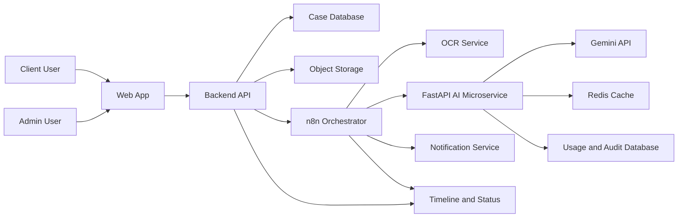
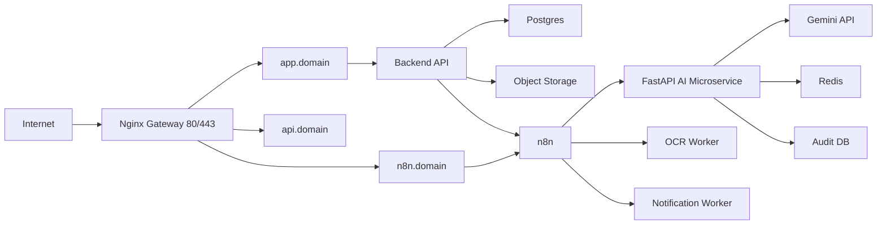

# LegalDesk AI Capstone Plan

## Tuyên bố dự án

- Dự án được xây mới hoàn toàn theo hướng **Legal Case Management + AI Copilot + n8n Orchestration**.
- AI microservice được xây bằng **Python FastAPI**.
- Model provider chính là **Gemini API**.
- **n8n** chỉ đóng vai trò orchestration và automation.
- **Web App** phục vụ 2 vai trò chính: **Client** và **Admin**.
- Bản bảo vệ tập trung vào **MVP chạy được end-to-end**, không đưa pricing/paywall vào scope chính.

## Trạng thái hiện tại

- `Milestone 1: Foundation` -> completed
- `Milestone 2: Bootstrap FastAPI` -> completed
- `Giai đoạn 0: Chốt phạm vi` -> completed
- `Giai đoạn 1: Bootstrap môi trường local` -> completed
- `Giai đoạn 2: Chốt API contract và schemas` -> completed
- `Milestone 3: AI Core` -> completed
- `Milestone 4: n8n Orchestration` -> completed
  - verified with imported local n8n workflows and smoke evidence in `docs/n8n-smoke-evidence.md`
- `Milestone 5+ / Giai đoạn 5+` -> pending

## Mục tiêu cuối kì

- Tạo được luồng xử lý hồ sơ pháp lý từ upload đến phân tích AI và publish kết quả.
- Cho phép client theo dõi hồ sơ, xem risk analysis và hỏi đáp theo từng case.
- Cho phép admin cấu hình routing rules, theo dõi logs, SLA và audit trail.
- Thể hiện rõ kiến trúc tách lớp:
  - **Web App**
  - **Backend / Business API**
  - **n8n Orchestrator**
  - **FastAPI AI Microservice**
- Demo được trên VPS bằng Docker Compose với Nginx reverse proxy.

## Stack chốt

- **Python 3.11**
- **FastAPI**
- **Pydantic**
- **Uvicorn**
- **Gemini API**
- **Docker Compose**
- **Nginx**
- **Postgres**
- **Redis**
- **pytest**

## Phạm vi chức năng của hệ thống

### 1) Client Portal

- Tạo hồ sơ vụ việc mới.
- Upload tài liệu pháp lý: PDF, DOCX, hình scan.
- Theo dõi pipeline xử lý hồ sơ:
  - `Uploaded`
  - `TextExtractOrOCR`
  - `AIAnalyzing`
  - `AutoPublished`
  - `Finalized`
- Xem kết quả AI:
  - `docType`
  - `riskScore`
  - `riskLevel`
  - `riskFlags`
  - `extractedFields`
  - `summary`
  - `recommendedAction`
- Chat theo từng hồ sơ.
- Xem timeline hoạt động và trạng thái SLA.

### 2) Admin Console

- Quản lý người dùng và vai trò.
- Cấu hình rule routing theo `riskScore`, `confidence`, `SLA`.
- Theo dõi audit logs, execution logs và timeline events.
- Giám sát hệ thống và tinh chỉnh ngưỡng điều hướng.

## Kiến trúc hệ thống



## Vai trò của từng lớp

- **Web App**
  - Hiển thị dữ liệu.
  - Thu thập input người dùng.
  - Không xử lý AI nặng.
- **Backend API**
  - Quản lý case, user, file metadata, timeline và business workflow.
  - Trigger n8n khi có long-running job.
- **n8n**
  - Điều hướng workflow intake, OCR, AI, notify, SLA.
  - Không chứa prompt pháp lý cốt lõi.
- **FastAPI AI Microservice**
  - Nhận input văn bản/ngữ cảnh.
  - Validate request.
  - Build prompt và gọi Gemini.
  - Chuẩn hóa output thành JSON ổn định.
  - Thêm guardrails, logging, retry, fallback.

## Kiến trúc nội bộ AI microservice

```text
ai-microservice/
  app/
    main.py
    api/
      routes/
        health.py
        legal.py
    core/
      config.py
      logging.py
      exceptions.py
    schemas/
      common.py
      legal_review.py
      legal_chat.py
      legal_redraft.py
    prompts/
      legal_review.py
      legal_chat.py
      legal_redraft.py
    services/
      gemini_client.py
      legal_review_service.py
      legal_chat_service.py
      legal_redraft_service.py
      parser_service.py
      retry_service.py
    utils/
      text_normalizer.py
      risk_mapper.py
  tests/
    test_health.py
    test_legal_review.py
    test_legal_chat.py
  Dockerfile
  docker-compose.yml
  requirements.txt
  .env.example
```

## Workflow n8n mục tiêu

- Workflow 1: Intake case và upload file.
- Workflow 2: OCR hoặc text extraction.
- Workflow 3: Call `POST /v1/legal/review`.
- Workflow 4: Auto decision và publish kết quả.
- Workflow 5: Notify và SLA reminders.
- Workflow 6: Re-analysis khi có follow-up trong chat.

## API contract dự kiến

### `GET /health`

- Mục đích: health check cho local, Docker và VPS.
- Output:
  - `status`
  - `service`
  - `timestamp`

### `GET /docs`

- Swagger UI phục vụ dev/test/demo nội bộ.

### `POST /v1/legal/review`

- Input:
  - `caseId`
  - `extractedText`
  - `metadata`
  - `language`
- Output:
  - `docType`
  - `confidence`
  - `riskScore`
  - `riskLevel`
  - `riskFlags`
  - `extractedFields`
  - `recommendedAction`
  - `summary`
  - `needsAttention`
  - `qualityWarning`

### `POST /v1/legal/chat`

- Input:
  - `caseId`
  - `question`
  - `conversationContext`
- Output:
  - `answer`
  - `citations`
  - `caution`
  - `confidence`
  - `needsAttention`

### `POST /v1/legal/redraft`

- Input:
  - `clauseText`
  - `objective`
- Output:
  - `revisedClause`
  - `rationale`

## Guardrails bắt buộc

- Validate request schema bằng Pydantic.
- Validate output schema sau khi model trả lời.
- Retry khi output không đúng JSON/schema.
- Fallback response khi model fail.
- Gắn `confidence`, `needsAttention`, `qualityWarning`.
- Luôn có disclaimer:
  - `Kết quả AI chỉ có giá trị tham khảo, không thay thế tư vấn pháp lý chuyên nghiệp.`

## Milestone triển khai

### Milestone 1: Foundation

- Chốt phạm vi MVP.
- Chốt role Client/Admin.
- Chốt entity tối thiểu:
  - Case
  - Document
  - AnalysisResult
  - ChatMessage
  - TimelineEvent
  - User
- Chốt status model và SLA fields.
- Khóa IA/navigation cho web app.

### Milestone 2: Bootstrap FastAPI

- Tạo skeleton FastAPI project.
- Tạo Dockerfile, docker-compose, .env.example.
- Tạo `GET /health`, `GET /docs`.
- Tạo Nginx reverse proxy local.
- Kết nối Postgres và Redis.

### Milestone 3: AI Core

- Tạo Gemini client wrapper.
- Tạo prompt layer cho legal review/chat/redraft.
- Tạo parser layer và output normalization.
- Thêm retry/fallback.
- Viết tests cho review/chat.

### Milestone 4: n8n Orchestration

- Build workflow intake.
- Build workflow OCR/text extraction.
- Build workflow gọi AI microservice.
- Build workflow notify và SLA.
- Build workflow re-analysis theo chat.

### Milestone 5: Web Integration

- Client tạo hồ sơ và xem kết quả.
- Client chat theo case.
- Admin cấu hình routing rules.
- Admin xem logs và audit trail.

### Milestone 6: Demo Readiness

- Chuẩn bị 3–5 case demo.
- Chuẩn bị script demo 8–10 phút.
- Đo KPI:
  - thời gian xử lý
  - tỉ lệ parse JSON thành công
  - tỉ lệ auto-route
  - tỉ lệ fallback

### Milestone 7: VPS Deployment

- Chuẩn bị VPS Linux.
- Cấu hình domain:
  - `app.<domain>`
  - `api.<domain>`
  - `n8n.<domain>`
- Viết `docker-compose.prod.yml`.
- Viết Nginx reverse proxy config.
- Chạy deploy production.

### Milestone 8: Production Hardening

- Bật HTTPS.
- Quản lý secrets bằng env production riêng.
- Chỉ expose `80/443`.
- Không expose Postgres/Redis public.
- Thêm auth cho n8n admin.
- Thêm health checks và smoke checks.

## Thiết kế production topology



## Flow hoạt động theo role

### Client flow

- Bước 1: Client đăng nhập.
- Bước 2: Tạo hồ sơ mới.
- Bước 3: Upload tài liệu.
- Bước 4: Backend tạo `caseId` và trigger n8n.
- Bước 5: n8n chạy OCR và gọi AI microservice.
- Bước 6: Kết quả được publish về case detail.
- Bước 7: Client xem risk analysis.
- Bước 8: Client hỏi follow-up trong tab chat.

### Admin flow

- Bước 1: Admin mở trang routing.
- Bước 2: Cấu hình rule:
  - `if riskScore >= 70 then needs_attention=true`
  - `if confidence < 0.55 then quality_warning=true`
  - `if SLA < 4h then escalate`
- Bước 3: Theo dõi logs và timeline.
- Bước 4: Tinh chỉnh ngưỡng để tối ưu luồng xử lý.

## Rủi ro và hướng giảm thiểu

- OCR kém với tài liệu scan xấu -> OCR fallback + cờ confidence thấp.
- Output model lỗi schema -> parser + validation + retry + fallback.
- Prompt drift giữa loại hồ sơ -> tách prompt theo category + test set nội bộ.
- Scope quá lớn -> ưu tiên thin vertical slice chạy được end-to-end trước.
- Quá tải khi demo -> caching, timeout, giới hạn input và chuẩn bị sample case ổn định.

## Tiêu chí nhấn mạnh khi bảo vệ

- Kiến trúc tách lớp rõ ràng.
- AI microservice độc lập, dễ giải thích, dễ kiểm thử.
- Có guardrails, audit, routing, SLA.
- Có demo end-to-end chạy thật trên VPS.
- Có thể chứng minh vận hành bằng `docker ps`, `health`, `logs`.

## Step-by-Step implementation plan

### Giai đoạn 0: Chốt phạm vi (0.5 ngày)

1. Chốt mode hệ thống: **full-auto**.
2. Chốt role: **Client** và **Admin**.
3. Chốt tính năng bắt buộc demo:
  - upload tài liệu
  - AI review tự động
  - chat theo hồ sơ
  - timeline trạng thái
  - admin routing rules + logs
4. Chuẩn bị 3 bộ dữ liệu: low, medium, high risk.

### Giai đoạn 1: Bootstrap môi trường local (1 ngày)

1. Tạo repo microservice mới.
2. Khởi tạo FastAPI project.
3. Tạo:
  - `Dockerfile`
  - `docker-compose.yml`
  - `nginx.conf`
  - `.env.example`
4. Tạo env local:
  - `APP_ENV`
  - `GEMINI_API_KEY`
  - `DATABASE_URL`
  - `REDIS_URL`
5. Build bằng:
  - `docker compose up -d --build`
6. Verify:
  - `GET /health`
  - `GET /docs`
  - Postgres OK
  - Redis OK

### Giai đoạn 2: Chốt API contract và schemas (1 ngày)

1. Tạo Pydantic models cho:
  - legal review request/response
  - legal chat request/response
  - common metadata
2. Chốt response schema cho web render.
3. Chốt error format thống nhất.

### Giai đoạn 3: Xây AI services (2-3 ngày)

1. Tạo Gemini client wrapper.
2. Tạo `legal_review_service`.
3. Tạo `legal_chat_service`.
4. Tạo `legal_redraft_service` nếu còn thời gian.
5. Thêm parser + schema validation.
6. Thêm retry và fallback.
7. Viết pytest.

### Giai đoạn 4: Tích hợp n8n (1-2 ngày)

1. Tạo workflow intake.
2. Tạo workflow OCR.
3. Gọi `POST /v1/legal/review`.
4. Gọi `POST /v1/legal/chat`.
5. Update status/timeline.
6. Thêm routing nhánh risk/confidence/SLA.

### Giai đoạn 5: Tích hợp web app (2-3 ngày)

1. Màn Client:
  - dashboard
  - create case
  - case detail
  - chat
2. Màn Admin:
  - routing rules
  - users
  - audit logs
3. Hiển thị disclaimer và warning badges.

### Giai đoạn 6: End-to-end testing (1 ngày)

1. Test low-risk case.
2. Test high-risk case.
3. Test OCR khó.
4. Test chat follow-up.
5. Ghi KPI và logs.

### Giai đoạn 7: Deploy VPS (1 ngày)

1. Cài Docker và Docker Compose.
2. Cấu hình DNS.
3. Chuẩn bị `.env.production`.
4. Chạy production stack.
5. Verify:
  - `docker ps`
  - `api.domain/health`
  - `app.domain`
  - `n8n.domain`

### Giai đoạn 8: Chuẩn bị bảo vệ (0.5-1 ngày)

1. Chốt script demo.
2. Chuẩn bị câu trả lời phản biện.
3. Chuẩn bị phương án fallback offline.

## Checklist demo khi bảo vệ

- `docker ps`
- `api.domain/health`
- `app.domain`
- `n8n.domain`
- tạo case mẫu
- show n8n execution
- show kết quả AI
- show routing rule
- show logs ngắn

## Definition of Done

- AI microservice chạy bằng **Python FastAPI** với Docker Compose.
- `GET /health` và `GET /docs` hoạt động ổn định.
- `POST /v1/legal/review` và `POST /v1/legal/chat` hoạt động đúng schema.
- n8n orchestration gọi được microservice và publish được kết quả.
- Demo thành công ít nhất 3 case mẫu.
- Stack chạy được trên VPS với Nginx reverse proxy.
- Có health checks, logs, audit trail và checklist vận hành cho buổi bảo vệ.
