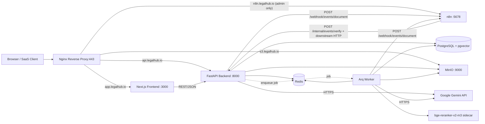
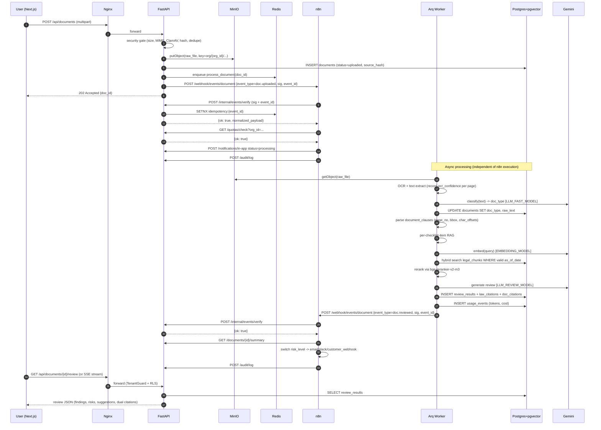
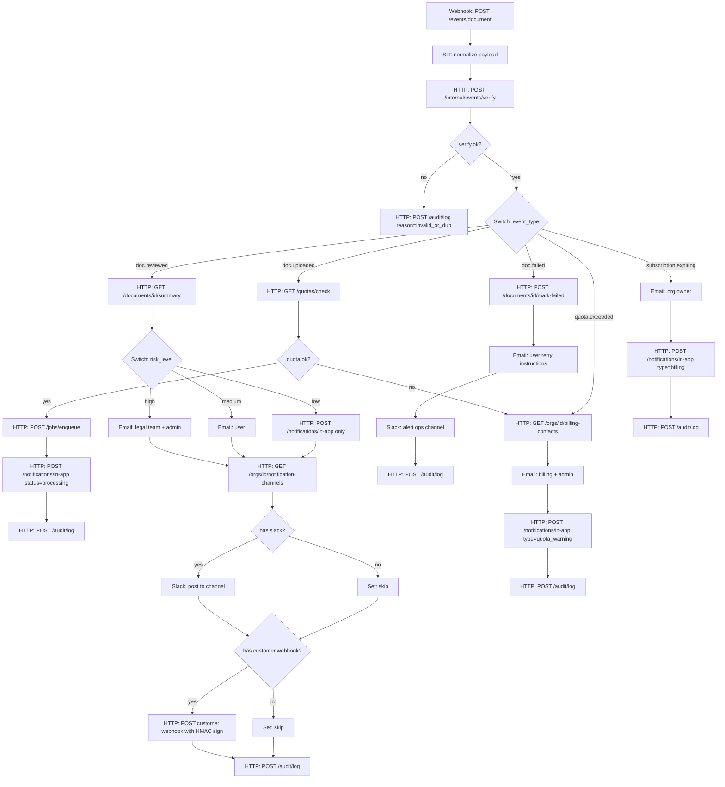
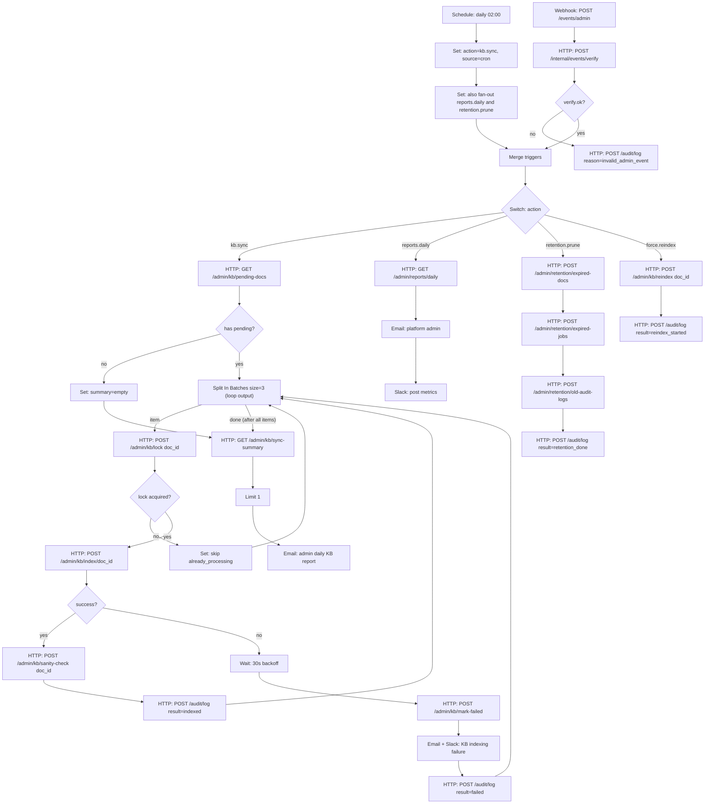

# LegalHub — Kế hoạch Kiến trúc & Triển khai

## 0. Stack đã chốt

- **Frontend**: **Next.js 16.x** (App Router, RSC) + TypeScript + TailwindCSS + shadcn/ui + TanStack Query
- **Backend AI/API**: FastAPI (Python 3.12) + Pydantic v2 + SQLAlchemy 2.0 + Alembic
- **Task Queue**: Arq (Redis-based, async-native) cho MVP. Bắt buộc đi kèm bảng `jobs` (idempotency key, retry policy, attempt count, last_error, cost/token usage).
- **Database**: **PostgreSQL 17.9** (pin minor cụ thể; cũng có thể chọn `18.3` nếu pgvector image đã chính thức hỗ trợ — verify trước Phase 0) + `pgvector >= 0.8.2` (security fix HNSW) + `pg_trgm` + `unaccent` + `btree_gin`. **PgBouncer** ở giữa app ↔ PG (transaction pooling). SQLAlchemy/asyncpg phải tắt server-side prepared statement cache (asyncpg `statement_cache_size=0`) hoặc dùng PgBouncer `prepared_statements_pool` (nếu PgBouncer ≥ 1.21) — bắt buộc để tránh lỗi với transaction pooling.
- **Cache/Queue/Session**: Redis 7 (pin: `redis:7.4-alpine`)
- **Object Storage**: MinIO (S3-compatible, self-hosted) — bucket `legalhub`, key prefix bắt buộc `org/{organization_id}/...` + SSE-S3 encryption at rest.
- **Orchestrator**: **n8n pinned version** (vd `n8nio/n8n:1.x.y`) chạy với Postgres persistence riêng (`n8n_db`), `N8N_ENCRYPTION_KEY`, basic auth + reverse proxy auth, `WEBHOOK_URL` cấu hình tường minh, execution data pruning (`EXECUTIONS_DATA_PRUNE=true`, `EXECUTIONS_DATA_MAX_AGE`).
- **Reverse Proxy**: Nginx (TLS termination, rate-limit, routing theo subdomain)
- **LLM** (config-driven, không hardcode):
  - `LLM_REVIEW_MODEL` — mặc định production: `gemini-2.5-pro` (stable, không alias `-latest`).
  - `LLM_FAST_MODEL` — mặc định: `gemini-2.5-flash` (classification, query-rewrite, draft).
  - `LLM_PREVIEW_MODEL` (optional, gated bằng feature flag): `gemini-3.x-preview` chỉ bật trong staging/eval.
  - `EMBEDDING_MODEL` — mặc định: **`gemini-embedding-2`** (stable, input limit cao hơn `gemini-embedding-001`, auto-normalize khi dùng truncated dimension qua Matryoshka). `EMBEDDING_DIM=1536` cho MVP (sweet spot chất lượng/chi phí; có thể đo và đổi 768/3072 sau khi có eval).
  - Provider adapter pattern (`LLMProvider`, `EmbeddingProvider`) để swap Anthropic/OpenAI/self-host sau này không sửa business logic.
- **OCR**: Tesseract (vi+eng) cho phase 1; sẵn adapter để upgrade lên Google Document AI nếu cần. Lưu **OCR quality score** mỗi trang.
- **Reranker**: `BAAI/bge-reranker-v2-m3` (self-host CPU-friendly) cho hybrid search.
- **Cost/Quota guardrail**: bảng `usage_events` (per-org token in/out, cost USD, model, latency) + bảng `quotas` (monthly token cap, document cap) — kiểm tra ở middleware trước khi gọi LLM.

---

## Bước 1 — System Architecture & Data Flow

### 1.1 Vì sao FastAPI cho Backend AI

- Hệ sinh thái AI/RAG Python áp đảo: `langchain`, `llama-index`, `sentence-transformers`, `unstructured`, `pdfplumber`, `pytesseract`, `google-genai`.
- Async-native (uvicorn + httpx) → throughput tốt khi gọi LLM (I/O-bound).
- Pydantic v2 schema validation = tự sinh OpenAPI cho n8n HTTP Request node consume trực tiếp.
- Triển khai theo **modular monolith** (1 codebase, nhiều module: `auth`, `documents`, `rag`, `review`, `admin`) — dễ tách microservice sau khi scale.

### 1.2 Sơ đồ services trong Docker Compose



**Lưu ý quan trọng**: Frontend KHÔNG gọi n8n trực tiếp. Browser chỉ nói chuyện với FastAPI; FastAPI và Worker là 2 nơi duy nhất bắn webhook đến n8n. Subdomain `n8n.legalhub.io` chỉ mở cho admin platform để xem executions UI (Nginx auth_basic + IP allowlist).

### 1.3 Data Flow đầy đủ — Upload & Review một tài liệu



**Nguyên tắc bám sát**: n8n chỉ làm 3 việc — (1) nhận webhook tại 2 endpoint cố định, (2) gọi HTTP đến FastAPI (verify + business endpoints), (3) push notification (email/slack/customer webhook). Mọi xử lý OCR/embedding/LLM/DB và auth/dedupe đều ở FastAPI + Worker. **Frontend không bao giờ gọi n8n trực tiếp**.

---

## Bước 2 — AI & RAG Strategy

### 2.1 Knowledge Base — Văn bản pháp luật VN

**Đặc thù**: Văn bản pháp luật VN có cấu trúc cây rất chuẩn:
> `Phần → Chương → Mục → Điều (Article) → Khoản (Clause) → Điểm (Point)`

Đây là **lợi thế lớn** so với RAG văn bản thường — ta KHÔNG nên dùng fixed-size chunking.

### 2.2 Structure-aware Hierarchical Chunking

- **Parser**: Regex + rule-based cho header `Điều \d+\.`, `\d+\.` (Khoản), `[a-z]\)` (Điểm). Output AST cây.
- **Chunk unit**: 1 chunk = 1 Điều (article-level), tối đa ~800 tokens. Nếu Điều quá dài → split theo Khoản nhưng giữ `parent_article_id`.
- **Versioning theo Điều/Khoản** (KHÔNG chỉ theo cả văn bản): luật VN thường được sửa đổi/bổ sung theo từng Điều/Khoản qua các văn bản sửa đổi. Mỗi chunk có vòng đời riêng.
- **Metadata bắt buộc lưu cùng mỗi chunk**:
  - `doc_id`, `doc_title` (vd: "Bộ luật Lao động 2019")
  - `doc_type` (luật / nghị định / thông tư / bộ luật / văn bản hợp nhất)
  - `issuing_body` (Quốc hội, Chính phủ, Bộ...)
  - **Vòng đời ở cấp document**: `effective_date`, `expiry_date`, `superseded_by_doc_id`
  - **Vòng đời ở cấp chunk** (mới): `valid_from`, `valid_to`, `amended_by_chunk_id`, `amends_chunk_id`, `status` (`active` | `amended` | `repealed` | `replaced`)
  - **Provenance** (mới): `source_url`, `source_hash` (SHA-256 của file gốc), `parsed_at`, `parser_version`
  - `chapter_no`, `section_no`, `article_no`, `clause_no`, `point_no`
  - `citation_path` (vd: "Điều 35, Khoản 2, Bộ luật Lao động 2019")
  - `jurisdiction` ("VN" / "EN-international")
  - `language` ("vi" / "en")
- **`as_of_date` của review**: mỗi `review_results` lưu `as_of_date` = ngày user yêu cầu review (mặc định `NOW()`). Retrieval luôn filter `valid_from <= as_of_date AND (valid_to IS NULL OR valid_to > as_of_date)` — đảm bảo review tái lập được sau này (point-in-time correct).

### 2.3 Storage schema (Postgres + pgvector)

```sql
-- pseudo, đã thêm versioning + provenance
legal_documents(
  id, title, doc_type, issuing_body,
  effective_date, expiry_date, superseded_by_doc_id,
  source_url, source_hash, parser_version,
  raw_object_key,            -- MinIO key
  ...
)

legal_chunks(
  id, document_id, parent_chunk_id,
  citation_path, article_no, clause_no, point_no,
  content TEXT,
  content_tsv TSVECTOR,                -- full-text VN (config: simple + unaccent + pg_trgm)
  embedding VECTOR(1536),              -- MVP: gemini-embedding-2 truncated to 1536d (Matryoshka)
  -- versioning
  valid_from DATE NOT NULL,
  valid_to   DATE,                     -- NULL = còn hiệu lực
  status     TEXT NOT NULL,            -- active|amended|repealed|replaced
  amended_by_chunk_id UUID,
  amends_chunk_id     UUID,
  -- provenance
  source_hash TEXT,
  parsed_at   TIMESTAMPTZ,
  metadata JSONB
);

-- Indexes
CREATE INDEX ON legal_chunks USING hnsw (embedding vector_cosine_ops)
  WITH (m = 16, ef_construction = 64);                       -- pgvector >= 0.8.2
CREATE INDEX ON legal_chunks USING gin (content_tsv);
CREATE INDEX ON legal_chunks USING gin (content gin_trgm_ops);
CREATE INDEX ON legal_chunks (status, valid_from, valid_to); -- point-in-time filter
CREATE INDEX ON legal_chunks (document_id, article_no, clause_no);
```

**Vector dimension policy**:
- MVP chốt cứng `VECTOR(1536)` cho cột `embedding` — đơn giản, đủ tốt, HNSW index gọn.
- Nếu cần multi-model A/B (so `gemini-embedding-2` vs `text-embedding-004` vs self-hosted BGE) → chuyển sang bảng phụ:
  ```sql
  chunk_embeddings(
    chunk_id UUID REFERENCES legal_chunks(id) ON DELETE CASCADE,
    model    TEXT NOT NULL,
    dim      INT  NOT NULL,
    embedding VECTOR,        -- không khai báo dim ở column, dim qua check constraint per row
    created_at TIMESTAMPTZ,
    PRIMARY KEY (chunk_id, model)
  );
  ```
  Chỉ làm khi thực sự cần — đừng over-engineer ở MVP.
- Khi đổi model/dim trong tương lai: tạo migration mới, dual-write trong N ngày, cutover bằng feature flag, drop cột cũ.

### 2.4 Retrieval — Hybrid + Rerank + Parent Expansion

1. **Query rewriting**: `LLM_FAST_MODEL` viết lại query của user thành 2-3 câu hỏi pháp lý chuẩn (vd: "có sa thải được không?" → "căn cứ chấm dứt HĐLĐ đơn phương từ phía NSDLĐ").
2. **Dual retrieval song song**:
   - **Vector search**: pgvector cosine, query embedding bằng `EMBEDDING_MODEL` → top 30.
   - **Lexical search**: bắt đầu MVP với Postgres `to_tsvector('simple', unaccent(content))` + `ts_rank_cd` + `pg_trgm` similarity. **Lưu ý**: `ts_rank` KHÔNG phải BM25 thuần; với corpus tiếng Việt cần đo recall cụ thể trên eval set. Đường nâng cấp khi recall không đạt: (a) extension `pg_search`/`paradedb` (BM25 thật trong Postgres), (b) tokenizer Vietnamese (vd `vncorenlp`/`underthesea`) tiền xử lý ở app layer trước khi đưa vào tsvector.
3. **Reciprocal Rank Fusion (RRF)** gộp 2 list → top 20.
4. **Cross-encoder rerank** (`bge-reranker-v2-m3`) → top 5-8.
5. **Parent expansion**: nếu chunk match là Khoản → kéo cả Điều cha vào context để LLM đủ ngữ cảnh.
6. **Point-in-time validity filter** (mới — bám sát versioning ở 2.2): với mọi review, dùng `as_of_date`:
   ```sql
   WHERE status = 'active'
     AND valid_from <= :as_of_date
     AND (valid_to IS NULL OR valid_to > :as_of_date)
     AND jurisdiction = ANY(:jurisdictions)
   ```
   Cho phép admin/lawyer chạy review "as_of" một ngày trong quá khứ để so sánh kết luận trước/sau khi có sửa đổi.

### 2.5 Document Classification trước khi Review

Classification là **gate**: phải biết loại tài liệu để chọn prompt review đúng.

- **Phase 1 — Zero-shot LLM** (đủ tốt cho MVP):
  - Gemini Flash + few-shot prompt liệt kê 8-12 loại: `Hợp đồng lao động`, `NDA/Bảo mật`, `Hợp đồng thương mại/mua bán`, `Hợp đồng dịch vụ`, `Hợp đồng cho thuê`, `Điều lệ công ty`, `Biên bản họp HĐQT`, `Quyết định bổ nhiệm/sa thải`, `Giấy ủy quyền`, `Other/Unknown`.
  - Output JSON `{doc_type, confidence, signals: [...]}` (Pydantic-validated).
  - Nếu `confidence < 0.7` → fallback `Other` + flag manual review.
- **Phase 2 — Fine-tuned classifier** (sau khi có ≥500 mẫu): PhoBERT/XLM-R, deploy như sidecar service. Fallback về LLM khi confidence thấp.

### 2.6 Review Pipeline — per Document Type

Mỗi `doc_type` có một **Review Checklist** (lưu trong bảng `review_templates`, admin chỉnh được qua UI). **Templates có versioning**: `review_templates(id, doc_type, version, items_jsonb, changelog, created_by, is_active)` — mỗi `review_results` lưu `template_version` để tái lập kết quả; rollback = đặt `is_active=true` cho version cũ.

- VD `Hợp đồng lao động`: kiểm tra (a) loại HĐ & thời hạn theo BLLĐ Đ.20, (b) lương ≥ tối thiểu vùng, (c) thời giờ làm việc Đ.105, (d) BHXH/BHYT bắt buộc, (e) điều khoản cấm cạnh tranh có hợp lệ không, (f) căn cứ chấm dứt Đ.34-36.
- Worker chạy **per-checklist-item** với RAG riêng cho từng item:
  - Build query từ item + đoạn văn liên quan trong document
  - Retrieve luật áp dụng (filter theo `as_of_date`)
  - `LLM_REVIEW_MODEL` generate kết quả: `{status: pass|warn|fail, finding, risk_level, suggestion, law_citations: [...], doc_citations: [...]}`.
- Tổng hợp toàn bộ items → **Compliance Score** + **Risk Map** + **Executive Summary**.
- **Citation kép — bắt buộc**:
  - `law_citations[]`: trỏ về `legal_chunks.id` + `citation_path` (Điều/Khoản/Điểm) + `valid_from/valid_to` snapshot.
  - `doc_citations[]`: trỏ về **đoạn trong tài liệu user** với đủ trường để frontend highlight chính xác:
    - `document_clause_id` (id của đoạn đã được parser của ta tách ra)
    - `page_no` (số trang trong PDF gốc)
    - `bbox` (`{x, y, w, h}` chuẩn hoá theo page size — lấy từ pdfplumber/Tesseract hOCR)
    - `char_offsets` (`{start, end}` trong `raw_text`)
    - `quote` (snippet text để hiển thị trong sidebar và chống lệch khi user re-OCR).

### 2.7 Anti-hallucination guardrails

- Bắt buộc LLM trả citations là `chunk_id` từ context đã cung cấp; backend validate `chunk_id` có tồn tại + còn hiệu lực tại `as_of_date`, nếu fake/expired → reject + retry (max 2 lần) → fallback `needs_human_review`.
- `doc_citations[].quote` phải khớp substring với `raw_text` (Levenshtein ≤ 5%); nếu không → reject.
- Lưu `prompt_hash + prompt_template_version + retrieved_chunks_hash + model + response` để audit + cache (Redis TTL 24h).
- Prompt injection defense: tách `system` (immutable) khỏi `user_document` (untrusted) bằng delimiter rõ ràng + scrub các chỉ thị nội tuyến trong tài liệu user trước khi đưa vào prompt.
- Disclaimer "AI-generated, not legal advice" hiển thị bắt buộc trên UI + lưu vào PDF export.

### 2.8 Eval Suite (golden set) — phải có từ MVP

- Repo `evals/`:
  - `evals/golden_docs/` — bộ tài liệu đại diện mỗi `doc_type` (≥10 doc/loại), kèm `expected.yaml` (expected `doc_type`, expected findings, expected citations chính xác đến Điều/Khoản).
  - `evals/run.py` — chạy pipeline thật trên KB snapshot, output metrics: classification accuracy, citation precision/recall@k, hallucination rate (citation không tồn tại), faithfulness (LLM-as-judge), latency p50/p95, cost/document.
  - **Gate trong CI**: PR sửa prompt/RAG bắt buộc chạy eval, không được giảm metric chính > ngưỡng.
- KB snapshot có `kb_version` (hash danh sách `legal_chunks.id` + `valid_*`) để eval tái lập được.

---

## Bước 3 — N8N Workflow Design

**Quyết định**: gộp thành **2 workflow lớn** (mỗi cái 18-28 node, giàu nhánh) thay vì 4 workflow nhỏ. Dễ chia ownership cho team 2 người (1 người sở hữu document lifecycle, 1 người sở hữu KB/admin), giảm số webhook URL phải quản lý, dễ trace end-to-end trong n8n executions UI.

**Allowed nodes**: `Webhook`, `Schedule Trigger`, `HTTP Request`, `IF`, `Switch`, `Set`, `Split In Batches`, `Merge`, `Email/SMTP`, `Slack`. **KHÔNG dùng** `Function`/`Code` node (mọi logic ở Backend). **KHÔNG dùng** `Wait for callback` trong document workflow (rủi ro timeout/state loss); `Wait` chỉ dùng trong KB workflow để rate-limit batch và backoff retry.

**HMAC + idempotency** (sửa lại): n8n không có Code node nên KHÔNG tự verify HMAC. Cách sạch: first HTTP node của mọi webhook gọi `POST /internal/events/verify` với payload + headers `X-Signature`, `X-Event-Id` → BE verify HMAC + check idempotency trong Redis (`SETNX` TTL 24h) → trả `{ok: true|false, reason, event_id, normalized_payload}`. n8n branch theo `ok`. Dedupe + auth tập trung ở BE, n8n chỉ orchestrate.

### Workflow 1 — `wf_document_lifecycle_ops` (~22-28 node)

**Mục tiêu**: 1 webhook duy nhất cho mọi sự kiện vòng đời tài liệu của user. Worker và FastAPI đều bắn về cùng endpoint với `event_type` khác nhau.

**Events handled**:
- `doc.uploaded` — user vừa upload xong (FastAPI bắn)
- `doc.reviewed` — Worker hoàn tất review thành công
- `doc.failed` — Worker fail sau khi đã hết retry
- `quota.exceeded` — middleware chặn job vì hết quota
- `subscription.expiring` — billing service bắn (cron BE)



- Trigger duy nhất: `POST {N8N_BASE}/webhook/events/document`.
- Mọi nhánh cuối đều ghi `audit_log` (compliance evidence).
- Customer webhook out-bound được BE ký HMAC trước khi trả về cho n8n forward → khách hàng tự verify.
- Execution ngắn (vài giây), không có `Wait`. Mỗi event là một execution độc lập trong n8n.
- **Quota path không vòng lại**: khi `doc.uploaded` quota fail, route trực tiếp vào nhánh `Q1` của event `quota.exceeded` trong cùng execution (KHÔNG bắn event mới vào `/events/document` để tránh vòng lặp execution và đếm idempotency 2 lần). Nếu sau này muốn tách quota notification ra hẳn thì BE chủ động bắn từ middleware, không qua n8n loopback.

### Workflow 2 — `wf_kb_admin_maintenance` (~18-25 node)

**Mục tiêu**: 1 workflow gộp KB sync (cron) + admin force-sync (manual webhook) + reporting + retention.

**Triggers**:
- Schedule trigger: 02:00 hằng ngày (KB sync + daily report)
- Webhook trigger: `POST /events/admin` cho admin force-sync hoặc retention runs



- **Schedule trigger phải set `action`** ngay sau khi fire (Set node `action=kb.sync, source=cron`) vì Schedule không tự gắn action; Webhook trigger thì lấy từ payload đã verify. Nếu cron cần chạy nhiều action (sync + report + retention), dùng Set fan-out + Split In Batches để loop từng action vào Switch.
- **Split In Batches có 2 output**: nhánh `item` (mỗi batch) loop ngược về node `K4` sau khi xử lý xong; nhánh `done` (sau batch cuối cùng) đi tiếp tới aggregate. **Bắt buộc `Limit 1`** trước khi gửi report để n8n không gửi N email = N batch (đây là lỗi rất hay gặp).
- `Set: summary=empty` ở nhánh "no pending" merge cùng node aggregate để không skip daily report khi KB rỗng.
- `Wait 30s` ở nhánh failed = backoff tự nhiên, không spam Gemini.
- `kb.lock` = idempotency cho KB sync (admin force-sync trùng cron không re-index 2 lần).
- `sanity-check` = mini retrieval test (vd query "Điều 1" của doc vừa index, verify chunk_id trả về match) — bắt lỗi parser sớm.
- Daily report tổng hợp: số chunk mới, số amendment, recall@k trên eval set, top failed jobs.

---

## Bước 4 — Action Plan (Phân chia Phases)

Mỗi phase có deliverable rõ ràng, có thể demo độc lập.

### MVP Cut — Phạm vi tối giản cho team 2 người (~6-7 tuần đến demo được)

Để team 2 người không vỡ kế hoạch, **MVP chỉ làm phần in đậm dưới đây**, phần còn lại defer sang Post-MVP.

**Thuộc MVP (must)**:
- Multi-tenant cơ bản: 1 org/user, RLS bật, audit log cốt lõi.
- 2 doc types: **Hợp đồng lao động + NDA** (thay vì 4-12 loại).
- Embedding `gemini-embedding-2` dim **768** (rẻ hơn, nâng 1536 sau khi đo eval).
- KB seed nhỏ: BLLĐ 2019, NĐ 145/2020, BLDS 2015 (chỉ 3 văn bản; chunk-level versioning vẫn giữ vì là design).
- OCR Tesseract + quality score; **manual correction = textarea đơn giản** (không cần inline editor on PDF).
- Hybrid search (`ts_rank + pg_trgm`) + bge-reranker.
- Review pipeline với **3-5 checklist item/loại** (không phải đầy đủ 10+).
- Citations: law_citations đầy đủ; doc_citations chỉ `page_no + char_offsets + quote` (bỏ `bbox` highlight chính xác — dùng search-and-highlight bằng quote ở FE).
- 2 n8n workflows như đã thiết kế.
- Frontend: auth, dashboard, list, document split-view (highlight bằng quote search, không bbox), admin KB upload, admin prompts read-only.
- Quota & usage tracking nhưng **không billing thật** (Stripe defer).
- Eval suite tối thiểu: 5 golden docs/loại, classification accuracy + citation precision; không cần CI gate cứng từ đầu.

**Defer sang Post-MVP (nice-to-have)**:
- Bbox-accurate highlight trên PDF (cần parser hOCR đầy đủ).
- Inline OCR correction.
- Admin prompt diff viewer + rollback UI (CRUD JSON là đủ cho MVP).
- Billing/Stripe tích hợp.
- MFA TOTP (chỉ basic email + password cho MVP).
- Customer webhook outbound, Slack notification (chỉ email cho MVP).
- Subscription expiring event, retention.prune action trong KB workflow.
- Multi-language i18n (chỉ tiếng Việt cho MVP).
- ParadeDB/pg_search nâng cấp lexical.
- pgBackRest PITR (chỉ pg_dump cron cho MVP).

**Nguyên tắc**: KHI nào quá deadline, cắt theo thứ tự "Defer" trên trước khi cắt vào "must".

### Phase 0 — Foundation & Infra (1 tuần)
- Repo monorepo: `apps/web`, `apps/api`, `apps/worker`, `apps/reranker`, `infra/`, `n8n/workflows/`, `evals/`.
- `docker-compose.yml` với **mọi image pin minor**: `postgres:17.9` (verify pgvector ≥ 0.8.2 wheel; alternative `pgvector/pgvector:pg17` pinned tag), `redis:7.4-alpine`, `minio/minio:RELEASE.YYYY-MM-DD`, `n8nio/n8n:1.x.y`, `nginx:1.27-alpine`, `pgbouncer/pgbouncer:1.23`.
- Postgres init script: cài `pgvector >= 0.8.2`, `pg_trgm`, `unaccent`, `btree_gin`, tạo role app + role n8n riêng, **2 database tách biệt**: `legalhub` (app) + `n8n` (n8n persistence).
- PgBouncer giữa app/worker và Postgres (transaction pooling, max_client_conn cao, server_pool_size theo CPU).
- n8n env: `N8N_ENCRYPTION_KEY`, `N8N_BASIC_AUTH_ACTIVE=true`, `WEBHOOK_URL=https://n8n.legalhub.io/`, `EXECUTIONS_DATA_PRUNE=true`, `EXECUTIONS_DATA_MAX_AGE=336` (14 ngày), `DB_TYPE=postgresdb`.
- Nginx config: TLS (self-signed dev, Let's Encrypt prod), routing theo subdomain, **rate-limit chỉ theo IP** (`limit_req_zone $binary_remote_addr`). **Per-org/per-token rate-limit làm trong FastAPI middleware** (slowapi/Redis-backed leaky bucket) vì cần decode JWT/API key — không thuộc trách nhiệm của Nginx (auth_request là anti-pattern cho hot path).
- `.env.example`, secret management (dev: `.env`, prod: Docker secrets / Vault sau).
- Healthcheck cho mọi service + `make up/down/logs/migrate/eval`.

### Phase 1 — Backend Skeleton, Auth & Multi-tenant Hardening (1.5 tuần)
- FastAPI app với cấu trúc module: `core/`, `auth/`, `tenants/`, `documents/`, `rag/`, `review/`, `admin/`, `billing/`, `audit/`.
- Alembic migrations với **multi-tenant first-class**:
  - Bảng "platform-level" (không có org): `users`, `organizations`, `memberships`, `legal_documents`, `legal_chunks`.
  - Bảng "scope-aware" — `review_templates(id, doc_type, scope, organization_id NULL, version, items_jsonb, changelog, is_active, created_by)`:
    - `scope='global'` + `organization_id=NULL` → template chuẩn do platform admin quản lý.
    - `scope='org'` + `organization_id=NOT NULL` → org admin override/extend cho riêng tenant.
    - Resolution rule: lookup `org` template trước, fallback `global`. RLS chỉ cho phép org thấy global + chính org của họ.
  - Bảng "tenant-owned" (BẮT BUỘC có `organization_id NOT NULL` + index composite `(organization_id, ...)`): `documents`, `document_clauses`, `review_results`, `review_findings`, `jobs`, `usage_events`, `quotas`, `audit_logs`, `notifications`, `api_keys`.
  - **Postgres RLS** bật trên mọi bảng tenant-owned (và `review_templates` với policy 2-state), policy `USING (organization_id = current_setting('app.current_org_id', true)::uuid)`. Tham số thứ 2 `true` cho `current_setting` để KHÔNG raise khi unset → kết hợp với rule fail-closed dưới đây.
  - **Transaction discipline (BẮT BUỘC, đặc biệt với PgBouncer transaction pooling)**:
    1. Mọi request DB chạy trong **explicit transaction** (`async with session.begin():`). Không dùng autocommit cho route business.
    2. FastAPI dependency `tenant_session()` set `SET LOCAL app.current_org_id = :org_id` ngay sau `BEGIN`, trước query đầu tiên.
    3. **Fail-closed**: nếu `app.current_org_id` chưa set hoặc không phải UUID hợp lệ → policy USING evaluate false → 0 row trả về (không leak data). Background jobs cũng phải set tương tự khi dùng connection.
    4. Tắt prepared-statement cache: `create_async_engine(..., connect_args={"statement_cache_size": 0, "prepared_statement_cache_size": 0})` hoặc dùng PgBouncer ≥1.21 với `prepared_statements_pool=true`.
    5. KHÔNG tin client gửi `org_id` qua request body cho RLS — luôn lấy từ JWT đã verify.
  - Defense-in-depth: app-level `TenantGuard` middleware kiểm tra `org_id` trong JWT khớp với resource path/body trước khi tin RLS.
  - Test `test_rls_leak.py`: tạo 2 org + data, query với `app.current_org_id` của org A, assert không thấy data org B.
- **Audit log**: mọi mutation viết bản ghi `audit_logs(actor_id, org_id, action, resource_type, resource_id, before_jsonb, after_jsonb, ip, ua, at)`. Bắt buộc cho data pháp lý (compliance evidence).
- **MinIO multi-tenant**: bucket dùng chung, key prefix bắt buộc `org/{organization_id}/documents/{doc_id}/{filename}`. SignedURL chỉ phát cho key có prefix khớp `org_id` của caller. SSE-S3 enabled.
- Auth: JWT (access 15m + refresh 30d) + RBAC (`platform_admin/owner/admin/lawyer/member`), password hash argon2id, optional TOTP MFA cho `owner/admin`.
- API key cho server-to-server (n8n → BE): bảng `api_keys`, scope theo route, lưu hash, rotation.
- OpenAPI auto-gen → import vào n8n credentials.

### Phase 2 — RAG Knowledge Base (2 tuần)
- Module ingestion: upload luật → MinIO → parse VN legal structure (regex `Điều/Khoản/Điểm`, output AST) → chunk → embedding qua `EmbeddingProvider` → insert pgvector.
- Versioning workflow: khi upload văn bản sửa đổi/bổ sung, parser nhận diện reference "sửa đổi Điều X Khoản Y của Luật Z" → cập nhật `valid_to` của chunk cũ + tạo chunk mới với `amends_chunk_id`. Có UI cho admin xem diff & duyệt trước khi commit.
- Endpoint `POST /admin/kb/index/{doc_id}`, `POST /rag/search` (hybrid + rerank, nhận `as_of_date` optional).
- **Embedding cache**: hash `(model, normalized_text)` → embedding, lưu Redis (hot) + Postgres bảng `embedding_cache` (cold) để không re-embed khi thay đổi prompt/template.
- Reranker sidecar service (FastAPI nhỏ chạy `bge-reranker-v2-m3` qua `sentence-transformers`).
- Seed bằng 5-10 văn bản trọng tâm (BLLĐ 2019, BLDS 2015, Luật Doanh nghiệp 2020, Luật Thương mại 2005, NĐ 145/2020, ...) — có cả văn bản sửa đổi để test versioning.
- Metric publish ra `/metrics`: KB size (chunks active/expired), index build time, query latency, recall@k trên eval set.

### Phase 3 — Document Review Pipeline (2 tuần)
- **File upload security gate** (chạy trước OCR):
  - Giới hạn: max 50MB, max 200 trang, MIME whitelist (`pdf`, `docx`, `png`, `jpg`).
  - MIME sniffing thật (libmagic) thay vì tin extension/Content-Type.
  - Virus scan: ClamAV sidecar; file bị flag → reject + alert.
  - Tính `source_hash` (SHA-256), dedupe trong cùng org để tránh double-charge LLM.
  - Encryption at rest: SSE-S3 ở MinIO (đã set ở Phase 0).
- OCR/text extract worker (`unstructured` + `pdfplumber` + `pytesseract` cho scanned).
- **OCR quality scoring**: mỗi trang lưu `ocr_confidence` (mean Tesseract confidence), `text_density`, `is_scanned`. Document có `min_page_confidence < threshold` → đánh dấu `needs_manual_correction`, route sang UI cho user/lawyer chỉnh trước khi chạy review (ngăn "rác vào → rác ra").
- Document parser tách `document_clauses` (đoạn/điều khoản trong tài liệu user) với `page_no`, `bbox`, `char_offsets` — phục vụ `doc_citations` ở 2.6.
- Classifier endpoint (`LLM_FAST_MODEL` zero-shot, JSON-mode, schema-validated).
- **Review templates** seeded cho 4 loại đầu tiên: HĐLĐ, NDA, HĐ thương mại, HĐ dịch vụ. Mỗi template có `version`, `changelog`, admin UI để rollback.
- Per-checklist-item runner trên Arq worker, parallel với `asyncio.gather` + bounded semaphore (rate-limit Gemini per minute).
- **Cost & quota guard**: trước mỗi job, middleware kiểm tra `quotas` của org; mỗi LLM call ghi `usage_events` (model, prompt_tokens, completion_tokens, cost_usd, latency_ms).
- Citation validation guardrail (xem 2.7).
- Endpoint `GET /documents/{id}/review` trả structured JSON cho FE render.

### Phase 4 — n8n Orchestration (4-5 ngày)
- Tạo **2 workflow lớn** (`wf_document_lifecycle_ops`, `wf_kb_admin_maintenance`), export JSON vào `n8n/workflows/` + import script (`n8n import:workflow --separate --input ...`).
- **Endpoint pattern**: chỉ 2 webhook URL: `POST /webhook/events/document` và `POST /webhook/events/admin`. BE/Worker gọi qua `N8N_WEBHOOK_BASE` + path; payload luôn có `event_type` để n8n switch.
- **HMAC + idempotency tập trung ở BE**: BE expose `POST /internal/events/verify` nhận body + `X-Signature` (HMAC SHA-256 với shared secret) + `X-Event-Id`, trả `{ok, reason, normalized_payload}`. n8n KHÔNG tự verify HMAC (không có Code node, dùng node Function/Crypto là anti-pattern). Mọi workflow gọi node verify đầu tiên.
- **Ownership**: Dev A own `wf_document_lifecycle_ops`, Dev B own `wf_kb_admin_maintenance`. Code review chéo qua git PR (workflow JSON commit vào repo).
- **Execution monitoring**: bật `EXECUTIONS_DATA_PRUNE`, expose Prometheus metrics qua `/metrics` của n8n, alert khi `failed_executions / 5min > N`.
- **Smoke test end-to-end**:
  1. Upload PDF → BE bắn `doc.uploaded` → n8n verify → quota check → enqueue → user thấy "processing".
  2. Worker xong → BE bắn `doc.reviewed` → n8n verify → switch risk → email + slack + customer webhook + audit.
  3. Force `doc.failed` (kill worker giữa chừng) → workflow nhánh failed chạy đủ.
  4. Cron 02:00 → KB sync chạy 1 doc test → sanity check pass → daily report.

### Phase 5 — Frontend SaaS (2.5 tuần)
- Next.js 16.x App Router (RSC + Server Actions), layout: marketing landing + auth + dashboard.
- Auth pages (login/register/forgot, OTP, MFA), middleware bảo vệ route + check `org_id` ở Server Component.
- Pages:
  - `/dashboard` — KPI org (số doc đã review, risk distribution, quota usage).
  - `/documents` (list + filter theo `doc_type`, `risk_level`, `status`).
  - `/documents/[id]` — **split view**:
    - Trái: PDF viewer (react-pdf) render từng trang, overlay highlight bằng `bbox` từ `doc_citations`. Click finding bên phải → scroll + flash highlight đoạn tương ứng (page_no + bbox).
    - Phải: list findings với badge risk, mỗi finding có 2 tab: `Trong tài liệu của bạn` (`doc_citations` quote) và `Căn cứ pháp luật` (`law_citations` với `citation_path` + link mở rộng đoạn luật).
    - Footer: compliance score, executive summary, button export PDF.
  - `/documents/[id]/correct-ocr` — UI sửa OCR khi `needs_manual_correction`.
  - `/admin/prompts` — CRUD review templates với version history + diff viewer + nút rollback.
  - `/admin/kb` — quản lý văn bản luật, xem versioning chunk, duyệt amendment.
  - `/admin/users`, `/admin/usage` (xem `usage_events` + cost), `/billing`.
- Realtime updates: SSE từ BE (`/events/stream?topic=doc.{id}`) để cập nhật progress (uploaded → ocr → classifying → reviewing → done).
- shadcn/ui components, dark mode, responsive, i18n vi/en.

### Phase 6 — Hardening & Production (1.5 tuần)
- Observability: Loki + Promtail + Grafana + OpenTelemetry tracing (FastAPI ↔ Worker ↔ Gemini), structured JSON logs với `trace_id`, `org_id`, `doc_id`, `job_id`.
- Dashboard Grafana: latency p50/p95 mỗi step (OCR, classify, retrieve, rerank, generate), token/cost per org, eval metrics theo build, n8n failed executions, RLS denial counter.
- Tests: pytest (unit + integration với testcontainers), Playwright e2e cho FE, contract test cho n8n workflows.
- **CI**: GitHub Actions — lint, type-check, unit/integration tests, **eval suite gate** (`evals/run.py` so sánh với baseline trên KB snapshot, fail nếu metric chính giảm > ngưỡng), build images, push registry, deploy staging.
- Backup: pg_dump cron (PITR với pgBackRest), MinIO replication, n8n workflow JSON commit vào git mỗi đêm (cron export).
- Security audit: rate limit (per IP + per org + per token), CSRF, input sanitization, prompt injection red team test, SAST (Bandit/Semgrep), dependency scan.
- Load test với k6 để xác định concurrency của worker, ngưỡng quota mặc định, và chi phí biên cho mỗi tier subscription.

---

## Quyết định mở (cần xác nhận khi tới phase tương ứng)
- Billing/subscription: Stripe vs LemonSqueezy (Post-MVP).
- Embedding dimension nâng cấp: 768 (MVP) → 1536 hay giữ 768 — quyết sau khi đo recall trên eval set ở cuối Phase 2.
- Lexical search: ở lại với `ts_rank + pg_trgm + unaccent`, hay sớm đưa `pg_search/paradedb` (BM25 thật) — quyết bằng eval recall ở Phase 2.
- LLM provider lock-in: có nên build adapter Anthropic/OpenAI ngay từ Phase 2 hay đợi Post-MVP.
- Có cần stream LLM response về FE qua SSE để UX tốt hơn không (Phase 5).
- Có cần thêm Qdrant nếu pgvector không đủ throughput ở scale ≥10M chunks (Post-MVP).
- Multi-region data residency cho khách hàng yêu cầu data ở VN (Post-MVP).
- Postgres 17.9 vs 18.3: verify pgvector image hỗ trợ chính thức trước Phase 0 — nếu chưa, giữ 17.9.

---

## Tóm tắt thay đổi sau review
- **Stack**: Next.js 14 → 16.x; Gemini 1.5 hardcode → config động `LLM_REVIEW_MODEL/LLM_FAST_MODEL/EMBEDDING_MODEL` mặc định Gemini 2.5 Pro/Flash + **`gemini-embedding-2`** (dim **1536** chốt cứng, MVP cut về 768); Postgres 16 → **17.9 pinned** (có note 18.3) + PgBouncer + tắt prepared-statement cache cho transaction pooling; pgvector ≥ 0.8.2; n8n pinned + Postgres persistence riêng + encryption key + execution pruning.
- **Versioning luật**: thêm `valid_from`, `valid_to`, `amended_by/amends`, `status`, `source_url`, `source_hash` ở **cấp chunk**; review có `as_of_date` để tái lập point-in-time.
- **Citation kép**: review trả cả `law_citations` (chunk_id + citation_path) và `doc_citations` (`document_clause_id`, `page_no`, `bbox`, `char_offsets`, `quote`) cho FE highlight chính xác. MVP highlight bằng quote search; bbox-accurate là Post-MVP.
- **Multi-tenant**: liệt kê tường minh bảng tenant-owned, `organization_id NOT NULL` + index, **Postgres RLS với transaction discipline** (explicit transaction, `SET LOCAL` first, fail-closed `current_setting('app.current_org_id', true)`, statement_cache_size=0), `review_templates` có `scope=global|org` + override; MinIO key prefix theo org; audit log đầy đủ; test RLS leak.
- **n8n workflows**: **2 workflow lớn** (`wf_document_lifecycle_ops` 22-28 node, `wf_kb_admin_maintenance` 18-25 node). Bỏ `Wait` khỏi luồng tài liệu; `Wait` chỉ dùng backoff batch trong KB. HMAC verify + idempotency tập trung ở BE qua `POST /internal/events/verify`. Schedule trigger có `Set: action=...` ngay sau fire. Split In Batches dùng đúng pattern `item`/`done` + `Limit 1` trước aggregate. Quota fail không loopback event mà route thẳng nhánh trong cùng execution.
- **Sequence diagram + topology**: cập nhật khớp endpoint `/webhook/events/document` + `/internal/events/verify`; **bỏ Web → n8n direct** (browser chỉ nói chuyện với FastAPI).
- **Nginx rate-limit**: chỉ theo IP; per-org/per-token chuyển vào FastAPI middleware.
- **Mới thêm**: bảng `jobs/usage_events/quotas`, eval suite + CI gate, file upload security (MIME sniff, virus scan, dedupe, SSE), OCR quality score + manual correction UI, prompt template versioning + rollback, anti-prompt-injection, OpenTelemetry tracing, **MVP Cut section** với danh mục must/defer rõ ràng cho team 2 người.