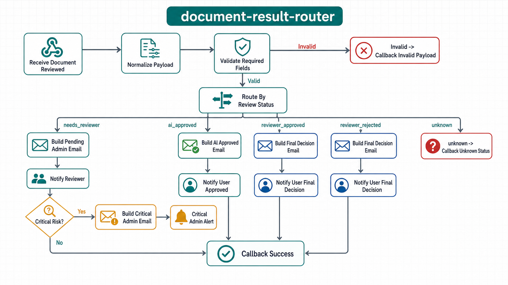
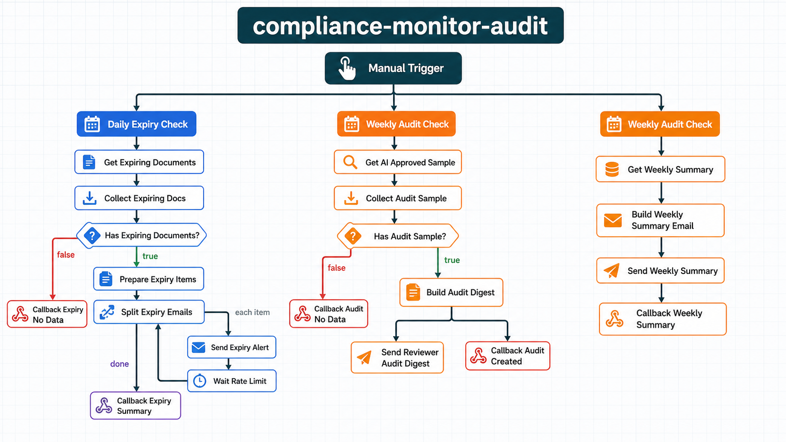
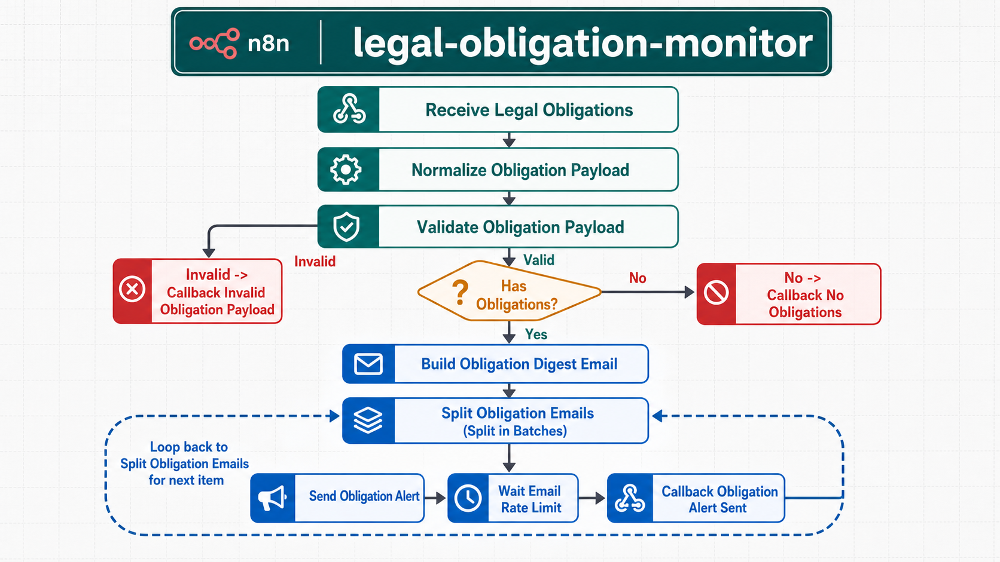

# N8N Workflow Study Guide (LegalReview) - Bản Chi Tiết Theo Từng Node

Tài liệu này phân tích chi tiết 3 workflow trong `n8n/workflows/` theo cách đi thi dễ trình bày: node nào nhận gì, xử lý gì, đẩy sang đâu, rẽ nhánh ra sao.

## 1) Tổng quan nhanh

| Workflow | Trigger | Mục tiêu | Pattern |
|---|---|---|---|
| `document-result-router` | Webhook `POST /document-reviewed` | Route kết quả review + gửi email + callback | Webhook + Switch/IF routing |
| `compliance-monitor-audit` | Manual + Schedule | Cảnh báo hết hạn, audit mẫu AI, tổng kết tuần | Scheduled + SplitInBatches |
| `legal-obligation-monitor` | Webhook `POST /legal-obligations` | Digest nghĩa vụ pháp lý + ưu tiên người nhận | Webhook + SplitInBatches loop |

## 2) Quy ước đọc luồng trong n8n

- `IF` node:
- `out0` = nhánh `true`.
- `out1` = nhánh `false`.
- `Switch` node:
- `out0..outN` map theo thứ tự rule cấu hình.
- `SplitInBatches` node (cấu hình ở workflow này):
- `out1` = item hiện tại để xử lý từng vòng loop.
- `out0` = luồng kết thúc loop (done).
- Các node callback trong repo này đều gọi về backend:
- `POST http://backend:8000/api/v1/webhooks/n8n-events`.

## 3) Workflow A - `document-result-router`



### 3.1 Mục tiêu nghiệp vụ
- Nhận sự kiện tài liệu đã được AI/reviewer xử lý.
- Chuẩn hóa trạng thái nghiệp vụ về 4 trạng thái chuẩn.
- Gửi email đúng đối tượng theo trạng thái.
- Ghi log callback thành công/thất bại về backend.

### 3.2 Luồng nhánh tổng quát
1. Webhook vào -> normalize payload -> validate bắt buộc.
2. Nếu invalid -> callback failed ngay.
3. Nếu valid -> switch theo `review_status`.
4. Mỗi nhánh gửi mail phù hợp và callback success.
5. Status lạ -> callback unknown status.

### 3.3 Chi tiết từng node

| # | Node | Type | Nhận từ | Xử lý chi tiết | Output chính | Đi tiếp |
|---|---|---|---|---|---|---|
| 1 | `Receive Document Reviewed` | webhook | HTTP POST `/document-reviewed` | Nhận payload từ FastAPI, `responseMode=onReceived` | Body webhook | `Normalize Payload` |
| 2 | `Normalize Payload` | code | Node 1 | Chuẩn hóa body: map alias status (`pending_admin->needs_reviewer`, `admin_approved->reviewer_approved`, `admin_rejected->reviewer_rejected`), ép `risk_score` thành number, dựng field fallback (`from_email`, `ops_email`, `manager_email`, URL), tính `valid` và `critical` (`risk_score>=85`) | JSON chuẩn nội bộ gồm `review_status`, `valid`, `critical`, email/url fields | `Validate Required Fields` |
| 3 | `Validate Required Fields` | if | Node 2 | Điều kiện: `$json.valid === true` | out0 true hoặc out1 false | out0 -> `Route By Review Status`; out1 -> `Callback Invalid Payload` |
| 4 | `Callback Invalid Payload` | httpRequest | Node 3 out1 | Callback event failed `notification.invalid_payload`, kèm lý do thiếu field bắt buộc | Event log invalid | End |
| 5 | `Route By Review Status` | switch | Node 3 out0 | Rẽ nhánh theo `review_status` với 4 rule và fallback extra | out0..out4 | out0 `needs_reviewer`; out1 `ai_approved`; out2 `reviewer_approved`; out3 `reviewer_rejected`; out4 unknown |
| 6 | `Build Pending Admin Email` | code | Node 5 out0 | Tạo mail cho reviewer/ops: subject + body có filename, risk score, flag reasons, reviewer/admin URL | `to=ops_email`, `subject`, `body` | Song song tới `Notify Reviewer`, `Critical Risk?`, `Callback Success` |
| 7 | `Notify Reviewer` | emailSend | Node 6 | Gửi mail text tới reviewer | Kết quả gửi mail | End |
| 8 | `Critical Risk?` | if | Node 6 | Kiểm tra `critical===true` | out0 true | out0 -> `Build Critical Admin Email` |
| 9 | `Build Critical Admin Email` | code | Node 8 out0 | Dựng mail cảnh báo mức nghiêm trọng cho manager. Chống gửi trùng: nếu `manager_email === ops_email` thì `return []` | Có thể trả item mail hoặc rỗng | Nếu có item -> `Critical Admin Alert` |
| 10 | `Critical Admin Alert` | emailSend | Node 9 | Gửi mail cảnh báo rủi ro nghiêm trọng | Kết quả gửi | End |
| 11 | `Build AI Approved Email` | code | Node 5 out1 | Tạo mail thông báo AI đã rà soát xong cho user | `to=user_email`, subject/body AI approved | Song song -> `Notify User Approved`, `Callback Success` |
| 12 | `Notify User Approved` | emailSend | Node 11 | Gửi mail text tới user | Kết quả gửi | End |
| 13 | `Build Final Decision Email` | code | Node 5 out2 hoặc out3 | Nếu `reviewer_approved` -> subject “đã duyệt”, nếu `reviewer_rejected` -> subject “cần xử lý lại”; mail cho user | `to=user_email`, subject/body final decision | Song song -> `Notify User Final Decision`, `Callback Success` |
| 14 | `Notify User Final Decision` | emailSend | Node 13 | Gửi mail text quyết định cuối | Kết quả gửi | End |
| 15 | `Callback Success` | httpRequest | Node 6/11/13 | Callback `notification.sent` thành công, payload gồm `document_id`, `review_status`, channel email | Event log success | End |
| 16 | `Callback Unknown Status` | httpRequest | Node 5 out4 | Callback failed `notification.unknown_status` khi status không khớp rule switch | Event log failed | End |
| 17 | `Demo Instructions` | stickyNote | Không vào luồng | Ghi chú demo trong canvas n8n | Không ảnh hưởng runtime | End |

### 3.4 Mapping nhánh status trong switch

| Output switch | Điều kiện | Flow chạy |
|---|---|---|
| out0 | `review_status = needs_reviewer` | Build Pending -> Notify Reviewer -> (có thể Critical Alert) + Callback Success |
| out1 | `review_status = ai_approved` | Build AI Approved -> Notify User Approved + Callback Success |
| out2 | `review_status = reviewer_approved` | Build Final Decision -> Notify User Final Decision + Callback Success |
| out3 | `review_status = reviewer_rejected` | Build Final Decision -> Notify User Final Decision + Callback Success |
| out4 | fallback | Callback Unknown Status |

### 3.5 Event callback của workflow A
- `notification.invalid_payload` (failed)
- `notification.sent` (success)
- `notification.unknown_status` (failed)

## 4) Workflow B - `compliance-monitor-audit`



### 4.1 Mục tiêu nghiệp vụ
- Nhánh Daily: cảnh báo tài liệu sắp hết hạn trong 7 ngày.
- Nhánh Weekly audit: lấy mẫu AI approved để reviewer audit chất lượng.
- Nhánh Weekly summary: gửi tổng kết tuần cho quản trị.

### 4.2 Trigger và lịch chạy
- `Manual Trigger`: test cả 3 nhánh cùng lúc.
- `Daily Expiry Check`: schedule mỗi ngày lúc 08:00.
- `Weekly Audit Check`: schedule mỗi tuần thứ 2 lúc 09:00.

### 4.3 Chi tiết từng node

| # | Node | Type | Nhận từ | Xử lý chi tiết | Output chính | Đi tiếp |
|---|---|---|---|---|---|---|
| 1 | `Manual Trigger` | manualTrigger | Manual click | Kickoff test 3 nhánh: expiry + audit + summary | Item trigger | `Get Expiring Documents`, `Get AI Approved Sample`, `Get Weekly Summary` |
| 2 | `Daily Expiry Check` | scheduleTrigger | Cron ngày | Trigger nhánh expiry tự động | Item trigger | `Get Expiring Documents` |
| 3 | `Weekly Audit Check` | scheduleTrigger | Cron tuần | Trigger nhánh audit sample + weekly summary | Item trigger | `Get AI Approved Sample`, `Get Weekly Summary` |
| 4 | `Get Expiring Documents` | httpRequest | Node 1/2 | GET `/api/v1/automation/expiring?days=7` | Danh sách docs gần hết hạn | `Collect Expiring Docs` |
| 5 | `Collect Expiring Docs` | code | Node 4 | Chuẩn hóa nhiều kiểu response (`json[]`, `json.data[]`, item đơn), dựng `{has_data, docs}` | `has_data`, `docs` | `Has Expiring Documents?` |
| 6 | `Has Expiring Documents?` | if | Node 5 | Check `has_data === true` | out0 true / out1 false | out0 -> `Prepare Expiry Items`; out1 -> `Callback Expiry No Data` |
| 7 | `Prepare Expiry Items` | code | Node 6 out0 | Mỗi doc thành 1 item email: `to=user_email`, subject/body nhắc hết hạn | N items email | `Split Expiry Emails` |
| 8 | `Split Expiry Emails` | splitInBatches | Node 7 (và loop từ node 10) | Batch size 1 để gửi từng email | out1 item, out0 done | out1 -> `Send Expiry Alert`; out0 -> `Callback Expiry Summary` |
| 9 | `Send Expiry Alert` | emailSend | Node 8 out1 | Gửi email text cảnh báo hết hạn | Kết quả gửi mail | `Wait Rate Limit` |
| 10 | `Wait Rate Limit` | wait | Node 9 | Delay 1 giây giữa các mail | Item sau delay | Quay lại `Split Expiry Emails` |
| 11 | `Callback Expiry Summary` | httpRequest | Node 8 out0 | Callback success `compliance.expiry_alert.completed`, gửi `sent_count = $('Prepare Expiry Items').all().length` | Event summary | End |
| 12 | `Callback Expiry No Data` | httpRequest | Node 6 out1 | Callback success `compliance.expiry_alert.no_data` với `sent_count=0` | Event no_data | End |
| 13 | `Get AI Approved Sample` | httpRequest | Node 1/3 | GET `/api/v1/automation/audit-sample?limit=5` | Danh sách mẫu AI approved | `Collect Audit Sample` |
| 14 | `Collect Audit Sample` | code | Node 13 | Chuẩn hóa list như node 5, dựng `{has_data, docs}` | `has_data`, `docs` | `Has Audit Sample?` |
| 15 | `Has Audit Sample?` | if | Node 14 | Check `has_data === true` | out0 true / out1 false | out0 -> `Build Audit Digest`; out1 -> `Callback Audit No Data` |
| 16 | `Build Audit Digest` | code | Node 15 out0 | Tạo digest text liệt kê mẫu: filename, classification, risk_score, reviewer/admin URL | `sample_count`, to/from, subject, body | Song song -> `Send Reviewer Audit Digest`, `Callback Audit Created` |
| 17 | `Send Reviewer Audit Digest` | emailSend | Node 16 | Gửi digest cho reviewer/ops | Kết quả gửi | End |
| 18 | `Callback Audit Created` | httpRequest | Node 16 | Callback `compliance.weekly_audit.created`, payload có `sample_count` | Event audit created | End |
| 19 | `Callback Audit No Data` | httpRequest | Node 15 out1 | Callback `compliance.weekly_audit.no_data` | Event audit no_data | End |
| 20 | `Get Weekly Summary` | httpRequest | Node 1/3 | GET `/api/v1/automation/weekly-summary` | Số liệu tuần | `Build Weekly Summary Email` |
| 21 | `Build Weekly Summary Email` | code | Node 20 | Format số liệu tuần: tổng docs, ai_approved, needs_reviewer, approved/rejected, failed, processing, agreement_rate | `to`, `subject`, `body`, số liệu tuần | Song song -> `Send Weekly Summary`, `Callback Weekly Summary` |
| 22 | `Send Weekly Summary` | emailSend | Node 21 | Gửi mail tổng kết tuần cho manager/admin | Kết quả gửi | End |
| 23 | `Callback Weekly Summary` | httpRequest | Node 21 | Callback `compliance.weekly_summary.sent` với `total_documents`, `agreement_rate` | Event summary sent | End |
| 24 | `Demo Instructions` | stickyNote | Không vào luồng | Ghi chú demo | Không ảnh hưởng runtime | End |

### 4.4 Tách 3 nhánh để học thuộc

| Nhánh | Trigger | Chuỗi node chính | Điểm cần nhớ |
|---|---|---|---|
| Expiry | Manual hoặc Daily | Get Expiring -> Collect -> IF has_data -> Prepare -> Split(loop Send/Wait) -> Callback Summary | Có loop rate-limit 1s, done output callback summary |
| Weekly audit sample | Manual hoặc Weekly | Get Sample -> Collect -> IF has_data -> Build Digest -> Send + Callback Created | Build xong tách song song send/callback |
| Weekly summary | Manual hoặc Weekly | Get Summary -> Build Weekly -> Send + Callback Weekly | Không có IF, luôn gửi nếu API trả dữ liệu |

### 4.5 Event callback của workflow B
- `compliance.expiry_alert.completed`
- `compliance.expiry_alert.no_data`
- `compliance.weekly_audit.created`
- `compliance.weekly_audit.no_data`
- `compliance.weekly_summary.sent`

## 5) Workflow C - `legal-obligation-monitor`



### 5.1 Mục tiêu nghiệp vụ
- Nhận obligations bóc tách từ AI.
- Validate payload tối thiểu.
- Nếu có obligations thì dựng 1 digest email đầy đủ (HTML + text).
- Chọn người nhận ưu tiên reviewer/ops khi có mức độ cao hoặc gần/quá hạn.

### 5.2 Luồng nhánh tổng quát
1. Webhook vào -> normalize payload.
2. IF `valid` false -> callback invalid.
3. IF `has_obligations` false -> callback no_data.
4. Nếu có obligations -> build digest -> split loop gửi từng item -> wait -> callback từng item -> quay lại split.

### 5.3 Chi tiết từng node

| # | Node | Type | Nhận từ | Xử lý chi tiết | Output chính | Đi tiếp |
|---|---|---|---|---|---|---|
| 1 | `Receive Legal Obligations` | webhook | HTTP POST `/legal-obligations` | Nhận payload nghĩa vụ pháp lý | Body webhook | `Normalize Obligation Payload` |
| 2 | `Normalize Obligation Payload` | code | Node 1 | Chuẩn hóa dữ liệu: lấy `obligations[]`, tính `high_priority_count`, `critical_count`, ép `risk_score` number, set fallback email/url, tính `valid` và `has_obligations` | JSON chuẩn gồm obligations + các cờ | `Validate Obligation Payload` |
| 3 | `Validate Obligation Payload` | if | Node 2 | Điều kiện `valid===true` (trace_id, document_id, user_email có đủ) | out0 true / out1 false | out0 -> `Has Obligations?`; out1 -> `Callback Invalid Obligation Payload` |
| 4 | `Callback Invalid Obligation Payload` | httpRequest | Node 3 out1 | Callback failed `legal_obligations.invalid_payload` | Event invalid | End |
| 5 | `Has Obligations?` | if | Node 3 out0 | Điều kiện `has_obligations===true` | out0 true / out1 false | out0 -> `Build Obligation Digest Email`; out1 -> `Callback No Obligations` |
| 6 | `Build Obligation Digest Email` | code | Node 5 out0 | Logic lớn: sort obligations theo due_date rồi severity; tính `highest_severity`, `highest_urgency`; xác định `needsReviewer`; chọn `to/cc`; dựng email `html` + `text`; set metadata `email_obligation_count` | Item email hoàn chỉnh + metadata | `Split Obligation Emails` |
| 7 | `Split Obligation Emails` | splitInBatches | Node 6 và loop từ node 10 | Batch size 1 để gửi từng email item | out1 item, out0 done (không nối) | out1 -> `Send Obligation Alert` |
| 8 | `Send Obligation Alert` | emailSend | Node 7 out1 | Gửi email cả `text` và `html`, có thể CC manager | Kết quả gửi | `Wait Email Rate Limit` |
| 9 | `Wait Email Rate Limit` | wait | Node 8 | Delay 1 giây | Item sau delay | `Callback Obligation Alert Sent` |
| 10 | `Callback Obligation Alert Sent` | httpRequest | Node 9 | Callback success `legal_obligations.alert_sent` kèm `obligation_count`, `highest_severity`, `highest_urgency`, `to`, `cc` | Event sent cho mỗi vòng loop | Quay lại `Split Obligation Emails` |
| 11 | `Callback No Obligations` | httpRequest | Node 5 out1 | Callback success `legal_obligations.no_data` với `obligation_count=0` | Event no_data | End |
| 12 | `Demo Instructions` | stickyNote | Không vào luồng | Ghi chú demo | Không ảnh hưởng runtime | End |

### 5.4 Logic chọn người nhận trong workflow C

| Điều kiện | Người nhận `to` | `cc` |
|---|---|---|
| Có item `severity in [critical, high]` hoặc `urgency in [overdue, due_soon]` | Ưu tiên `ops_email` (fallback `manager_email` rồi `user_email`) | `manager_email` nếu khác `to` |
| Chỉ mức bình thường | `user_email` | Rỗng |

### 5.5 Event callback của workflow C
- `legal_obligations.invalid_payload`
- `legal_obligations.no_data`
- `legal_obligations.alert_sent`

## 6) Payload mẫu để test từng webhook

### 6.1 Test `document-result-router`
```json
{
  "trace_id": "trace-123",
  "document_id": "doc-456",
  "user_email": "user@example.com",
  "review_status": "pending_admin",
  "risk_score": 92,
  "filename": "contract-a.pdf",
  "ops_email": "reviewer@example.com",
  "manager_email": "admin@example.com",
  "reviewer_url": "https://app/reviewer/doc-456",
  "client_url": "https://app/client/doc-456"
}
```

### 6.2 Test `legal-obligation-monitor`
```json
{
  "trace_id": "trace-789",
  "document_id": "doc-001",
  "user_email": "user@example.com",
  "filename": "lease.pdf",
  "obligations": [
    {
      "title": "Nộp báo cáo định kỳ",
      "severity": "high",
      "urgency": "due_soon",
      "due_date": "2026-05-20",
      "days_left": 5,
      "recommended_action": "Chuẩn bị hồ sơ và nộp trước hạn"
    }
  ]
}
```

## 7) Checklist học thuộc trước khi thi

1. Nhớ IF: `out0=true`, `out1=false`.
2. Nhớ switch của workflow A có 4 trạng thái chuẩn + 1 fallback unknown.
3. Nhớ loop chuẩn trong B/C: `Split -> Send -> Wait -> (callback) -> quay lại Split`.
4. Nhớ workflow B có 3 nhánh tách biệt nhưng chạy chung trong 1 file.
5. Nhớ callback event name đại diện để phân biệt 3 workflow.
6. Nhớ `critical` của workflow A được tính từ `risk_score >= 85`.
7. Nhớ workflow C chọn người nhận theo severity/urgency chứ không cố định luôn user.

## 8) Bẫy dễ nhầm khi vấn đáp

- Workflow A: `Callback Success` nối trực tiếp từ node build email (6/11/13), nên callback có thể chạy song song với node gửi mail kế bên trong cùng nhánh.
- Workflow B: `Weekly Audit Check` kích hoạt cả nhánh audit sample và weekly summary.
- Workflow C: callback `legal_obligations.alert_sent` phát theo từng vòng loop item, không phải callback tổng kết cuối cùng.
- Workflow C: `Split Obligation Emails` có output done (`out0`) nhưng hiện không nối node downstream.

---

Nguồn: phân tích trực tiếp từ 3 JSON trong `n8n/workflows/` (cập nhật ngày 2026-05-15).
